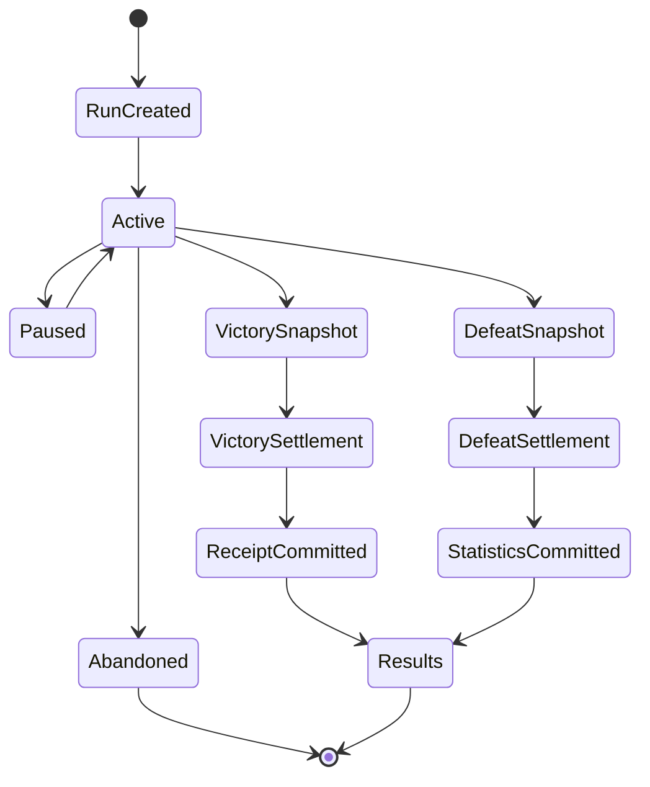
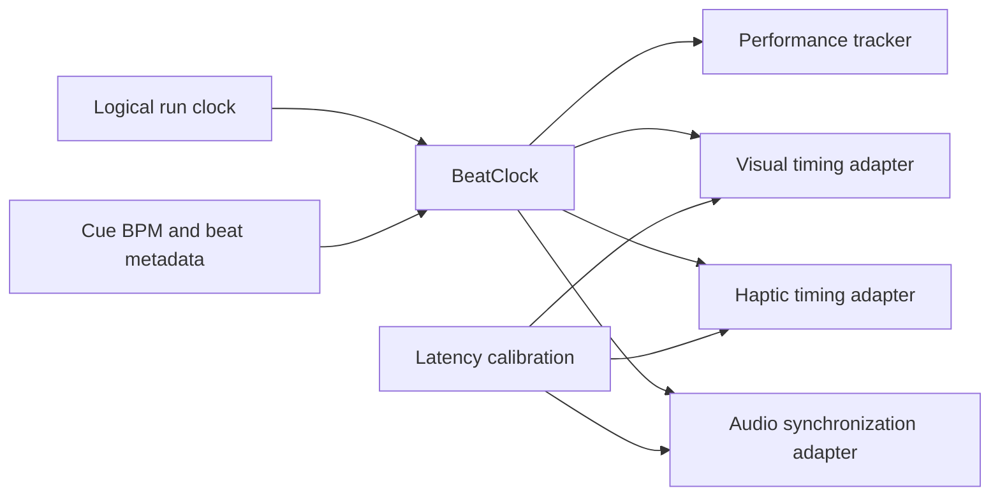
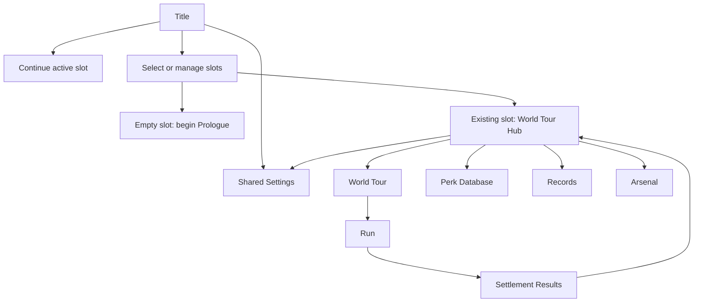

# Groove Bound: World Tour

## World Tour V1 — Detailed Technical Product and Implementation Plan

**Document status:** Approved implementation contract
**Implementation status:** Stage 1 save foundation locally implemented and integrated
**Classification:** Canonical World Tour V1 implementation plan
**Canonical runtime:** `groove-bound/`
**Canonical project state:** `LATEST_VERSION_HANDOVER.md` plus live repository evidence
**Target runtime:** Lua on LÖVE 11.5
**Plan version:** 1.0
**Prepared:** 2026-08-10, Australia/Sydney

---

## Table of contents

1. [Purpose](#1-purpose)
2. [Current verified baseline](#2-current-verified-baseline)
3. [Outcome and acceptance contract](#3-outcome-and-acceptance-contract)
4. [Locked product decisions](#4-locked-product-decisions)
5. [Scope cap](#5-scope-cap)
6. [Domain model](#6-domain-model)
7. [Proposed code ownership](#7-proposed-code-ownership)
8. [Save system design](#8-save-system-design)
9. [Run lifecycle and settlement](#9-run-lifecycle-and-settlement)
10. [Economy specification](#10-economy-specification)
11. [Grade and performance system](#11-grade-and-performance-system)
12. [BeatClock architecture](#12-beatclock-architecture)
13. [Fixed reward ladder](#13-fixed-reward-ladder)
14. [Perk system](#14-perk-system)
15. [World Tour content](#15-world-tour-content)
16. [Prologue integration](#16-prologue-integration)
17. [Remix tiers](#17-remix-tiers)
18. [Interface architecture](#18-interface-architecture)
19. [Accessibility](#19-accessibility)
20. [Media plan](#20-media-plan)
21. [Content validation](#21-content-validation)
22. [Events and integration contracts](#22-events-and-integration-contracts)
23. [Testing strategy](#23-testing-strategy)
24. [Admin and observability](#24-admin-and-observability)
25. [Dependency-ordered implementation roadmap](#25-dependency-ordered-implementation-roadmap)
26. [Risk register](#26-risk-register)
27. [Approval gates](#27-approval-gates)
28. [Definition of complete World Tour V1](#28-definition-of-complete-world-tour-v1)
29. [Decision ledger](#appendix-a-decision-ledger)
30. [Proposed first implementation file set](#appendix-b-proposed-first-implementation-file-set)
31. [Status statement](#appendix-c-status-statement)

---

## 1. Purpose

This document defines the first capped evolution of Groove Bound from its current
two-stage campaign preview into a persistent, replayable musical World Tour.

The specification covers:

- shared device settings and three isolated progression slots;
- crash-resistant versioned saves and non-destructive migration;
- terminal run settlement and reward idempotency;
- a permanent single-currency economy;
- a validated catalog of nineteen automatically active global perks;
- five-pillar performance grading with genre-specific weights;
- deterministic fixed grade rewards;
- one mandatory two-stage Prologue Campaign;
- six linear core genre worlds;
- three mastery-gated secret genre worlds;
- optional Remix tiers;
- a dedicated Perk Database and World Tour hub;
- deterministic BeatClock and additive rhythm scoring;
- accessibility, media, testing, rollout, recovery, and release requirements.

Implementation on `codex/world-tour-v1` is authorized. Asset adoption, commit,
push, merge, release, signing, notarization, and deployment remain separately
approval-gated.

---

## 2. Current verified baseline

### 2.1 Repository state at authoring

The live repository snapshot at authoring was:

| Field | Value |
|---|---|
| Repository root | `/Users/raonilima/Documents/Groove Bound` |
| Canonical runtime | `groove-bound/` |
| Branch | `GPT/stage-2-cutscenes` |
| HEAD | `fc150a4` — Record GitHub README presentation update |
| Upstream | `origin/GPT/stage-2-cutscenes` |
| Working changes before this document | 0 |
| Lua source files | 80 |
| Lua test files | 41 |
| Runtime | LÖVE 11.5 |

The latest handover snapshot reports 269 tests passing and clean lint across 123
files. Those checks were not rerun for this documentation-only task.

### 2.2 Existing product flow

The current preview flow is:

```text
Title
  -> Prologue
  -> Character Selection
  -> Character Introduction
  -> Backbeat Streets
  -> Inter-stage Cutscene
  -> The Orbit Line
  -> Campaign Ending
```

Joe and Lyra Vex share the same campaign structure but have differentiated
weapons, traits, statistics, logos, and animation. The player carries one build
through the two three-minute stages.

### 2.3 Existing relevant systems

The plan extends rather than replaces these owners:

| Concern | Current owner |
|---|---|
| Versioned save envelope | `groove-bound/src/core/save.lua` |
| Save defaults and options | `groove-bound/src/config/settings.lua` |
| Application container | `groove-bound/main.lua` |
| Run presentation and transitions | `groove-bound/src/ui/screens/run.lua` |
| Terminal results presentation | `groove-bound/src/ui/screens/results.lua` |
| Run progression and in-run coins | `groove-bound/src/game/systems/progression_system.lua` |
| Combat outcome and statistics | `groove-bound/src/game/systems/combat_system.lua` |
| Run-scoped lifecycle | `groove-bound/src/game/run_context.lua` |
| Campaign stage definitions | `groove-bound/src/content/stages.lua` |
| Content boot validation | `groove-bound/src/content/validate.lua` |
| Music definitions and BPM metadata | `groove-bound/src/content/music.lua` |
| Music playback and transitions | `groove-bound/src/audio/music_director.lua` |
| Screen stack | `groove-bound/src/core/state_machine.lua` |
| Input action gating | `groove-bound/src/game/input_event_gate.lua` |

### 2.4 Existing save limitations

The current save is one `save.json` envelope with schema version 1:

```lua
{
  version = 1,
  data = {
    coins = 0,
    options = {
      master_volume = 1.0,
      music_volume = 0.8,
      sfx_volume = 0.8,
      muted = false,
      screen_shake = true,
      hit_flash = true,
      vibration = true,
      aim_assist = true,
      camera_zoom = 1.0,
      deadzone = 0.25,
      fullscreen = false,
      controls = {},
    },
  },
}
```

The current loader fills missing defaults and falls back to defaults when a save
is corrupt. The current writer writes directly to the destination filename. The
World Tour V1 must prevent silent apparent data loss, isolate slot corruption,
and provide recovery and portable export.

---

## 3. Outcome and acceptance contract

### 3.1 Outcome

Deliver a persistent World Tour in which:

1. A player selects one of three progression slots.
2. A new slot must complete the existing two-stage Prologue Campaign once.
3. Prologue victory unlocks the World Tour hub, a starter perk, and the first
   core world.
4. Each World Tour world is one complete standalone run.
5. Terminal victory calculates a deterministic grade and one atomic settlement.
6. The settlement banks money, advances records, unlocks fixed rewards, and
   updates world access.
7. The player spends banked money in the Perk Database.
8. All owned perk ranks automatically enhance future runs.
9. Mastery across paired core genres reveals three secret worlds.

### 3.2 Protected behavior

Implementation must preserve:

- Joe and Lyra Vex;
- Backbeat Streets and The Orbit Line;
- build carryover between those two Prologue stages;
- current weapon, support, fusion, enemy, and boss stable IDs;
- deterministic named RNG stream ownership;
- state-stack and run-context teardown;
- event cleanup, pooling, and spatial indexing;
- current keyboard, mouse, and generic gamepad support;
- existing persistent control, volume, fullscreen, deadzone, aim-assist,
  vibration, flash, shake, and camera-zoom behavior;
- the bright urban-supernatural, music-meets-cosmic-robot identity;
- runtime/source asset separation and provenance;
- current save envelope importability.

### 3.3 Required delivery state

The implementation is not accepted merely because code exists. Final acceptance
requires separate evidence for:

- locally implemented behavior;
- focused tests;
- full test suite;
- lint;
- content validation;
- seeded full-run simulation;
- graphical and controller QA;
- audio and BeatClock QA;
- save recovery on clean-machine fixtures;
- package integrity;
- committed state;
- pushed state;
- any separately approved release state.

---

## 4. Locked product decisions

The following are product decisions, not tuning proposals.

### 4.1 Meta progression

- Progression is mostly horizontal with small capped vertical bonuses.
- Permanent perks never replace run-level weapons, supports, evolutions, or
  character identity.
- Every owned perk rank is automatically active.
- There is no perk loadout.
- Perks have one, three, or five ranks according to rarity and power.
- Each perk has one unique sprite.
- Owned and remaining ranks are displayed as filled and empty dots beneath the
  sprite, reinforced by text such as `2 / 5`.
- Unlocking a perk grants rank 1 immediately.
- Remaining ranks are purchased manually in the Perk Database.
- Normal purchases are permanent and cannot be refunded.
- If a later update materially redesigns or weakens a perk, all money spent on
  that perk is automatically refunded exactly once.
- The complete World Tour V1 catalog contains nineteen perks.

### 4.2 Save timing and outcomes

- Run-derived progression is saved only at terminal results.
- Victory saves the complete settlement.
- Defeat saves lifetime statistics only.
- Defeat grants no banked money, perk, discovery, grade reward, collection
  progress, or world progression.
- Quitting, closing, crashing, or otherwise interrupting an unfinished run
  abandons it completely.
- There is no mid-run checkpoint.
- There is no suspend or resume snapshot.

Explicit out-of-run user actions save immediately:

- changing shared settings;
- purchasing a perk rank;
- resetting a slot;
- importing a slot.

### 4.3 Slot and portability model

- The game exposes three independent progression slots.
- Device settings are shared across all slots.
- A player may reset one whole slot.
- Reset never alters shared settings.
- Granular partial resets are not supported.
- An individual progression slot may be manually exported and imported.
- Exported slots never include device settings.
- Cloud sync, online accounts, and automatic cross-device synchronization are
  outside this version.

### 4.4 World and campaign model

- The current two-stage campaign remains one special Prologue Campaign.
- Prologue is mandatory once per progression slot.
- Prologue produces one final grade and one final settlement.
- After first Prologue victory, it becomes replayable.
- Every World Tour genre location is one complete standalone run.
- The core World Tour is linear:
  Funk -> Soul -> Disco -> House -> Electro -> Techno.
- Clearing the current core world unlocks the next core world regardless of
  grade.
- Three optional secret worlds branch from paired genre mastery.
- Standard-world difficulty is fixed and never secretly scales to profile power.
- Optional Remix tiers add transparent difficulty and better Encore payouts.

### 4.5 Performance and rewards

- Successful runs use five universal performance pillars:
  Groove, Impact, Control, Craft, and World Mastery.
- Each genre configures different weights for those pillars.
- Grades are:
  D — Soundcheck,
  C — On Beat,
  B — In the Pocket,
  A — Headliner,
  S — Perfect Groove.
- Permanent perks fully count toward grades.
- Result records store the exact perk ranks used.
- World and grade rewards are fixed, deterministic, and claimable once.
- A locked perk is anonymous everywhere until earned.
- Reward ladders display `Mystery Perk` without name, sprite, effect, rarity,
  rank count, or cost.
- Each world awards its first mystery perk at C.
- Each world awards its second mystery perk at A.

### 4.6 Economy

- There is one universal permanent currency.
- Existing terminology and data compatibility use `coins` until player-facing
  naming is intentionally changed.
- Victory payout is:
  world base payout + grade bonus + capped in-run earnings.
- First clear and each newly improved best grade provide substantial one-time
  bonuses.
- Repeat victory always banks capped in-run earnings and a smaller Encore
  payout.
- Defeat loses all unbanked run money.

### 4.7 Rhythm

- Rhythm enhances baseline play but is not mandatory.
- Off-beat combat, movement, aiming, pickup, and survival remain fully valid.
- On-beat actions contribute additive score or bounded positive bonuses.
- Rhythm requires visual cues, latency calibration, adjustable timing windows,
  reduced-flash alternatives, reduced-motion alternatives, and optional
  vibration.

---

## 5. Scope cap

### 5.1 Included

- one two-stage mandatory Prologue Campaign;
- six core standalone worlds;
- three secret standalone worlds;
- nineteen permanent perks;
- three progression slots;
- shared device settings;
- manual slot export/import;
- full slot reset;
- one permanent currency;
- grade, records, reward claims, and settlement;
- two Remix tiers per world;
- World Tour, Perk Database, Records, and slot-management screens;
- deterministic BeatClock and genre grading;
- required world, perk, enemy, boss, environment, icon, VFX, and music assets;
- accessibility and clean-machine recovery;
- complete automated and manual acceptance layers.

### 5.2 Explicitly excluded

- cloud saves;
- player accounts;
- online leaderboards;
- live-service economy;
- battle pass or seasonal reset;
- daily or weekly challenges;
- mid-run save, checkpoint, suspend, or resume;
- more than three progression slots;
- more than nine World Tour worlds;
- more than nineteen perks;
- multiple permanent currencies;
- random meta reward rolls;
- perk loadouts;
- ordinary perk refunds or respec;
- granular slot reset;
- engine migration;
- native console submission;
- production deployment or public release without separate approval.

---

## 6. Domain model

### 6.1 Ubiquitous language

| Term | Definition |
|---|---|
| Device Settings | Machine-specific options shared by all progression slots |
| Progression Slot | One isolated persistent player journey |
| Slot Summary | Safe lightweight information displayed before a slot is opened |
| Prologue Campaign | The existing two-stage carried-build campaign |
| World | A standalone World Tour run based on one genre |
| Core World | One of the six linear worlds |
| Secret World | One of three optional paired-mastery worlds |
| Remix Tier | An explicit harder variant of a world |
| Run | One in-memory attempt from launch to terminal outcome or abandonment |
| Terminal Outcome | Victory or defeat; abandonment is not terminal settlement |
| Result Snapshot | Immutable run facts captured before settlement |
| Performance Pillar | One normalized grading component from zero to one hundred |
| Grade | D, C, B, A, or S derived from a successful Result Snapshot |
| Settlement | Pure calculation plus one persistent commit of terminal results |
| Settlement Receipt | Immutable player-facing record of what was committed |
| Wallet | Slot-owned permanent currency state |
| Currency Ledger | Append-only record of permanent currency mutations |
| Reward Definition | Static content describing a fixed claim condition and grant |
| Reward Claim | Slot state proving a one-time reward has been granted |
| Perk Definition | Static validated content describing a perk |
| Perk Ownership | Slot state describing unlock, rank, spend, and revision |
| Perk Modifier Snapshot | Immutable effective bonuses copied into a new run |
| World Record | Slot-owned best grade, score, pillars, build, and perk state |
| Encore Payout | Repeat-victory payout after one-time bonuses are exhausted |
| BeatClock | Deterministic musical phase derived from logical time and cue metadata |

### 6.2 Aggregate boundaries

The persistent model has two top-level aggregates:

1. **DeviceSettingsAggregate**
   - one per installation;
   - independent from progression;
   - may be saved immediately;
   - never exported with a slot.

2. **ProgressionSlotAggregate**
   - exactly zero or one per slot index;
   - owns Prologue progress, wallet, perks, worlds, claims, records, and
     statistics;
   - is replaced only by validated atomic commit, reset, or import;
   - never contains a live run snapshot.

Static definitions are not persistent player state:

- worlds;
- perks;
- grade profiles;
- rewards;
- Remix definitions;
- enemy, stage, wave, weapon, support, evolution, music, and asset definitions.

The save stores stable IDs and values, not copied content definitions.

### 6.3 Core invariants

1. Slot index is one, two, or three.
2. Wallet balance and counters are non-negative integers.
3. Every perk ownership ID resolves to one Perk Definition.
4. Owned perk rank is between one and `max_rank`.
5. Locked perks have no ownership record.
6. A Reward Claim ID is unique within its slot.
7. One Settlement ID may be committed at most once.
8. A grade exists only for victory.
9. Defeat changes statistics but no wallet, claim, unlock, perk, grade, or
   record-best state.
10. Abandonment performs no slot write.
11. A core world can be unlocked only by Prologue completion or prior-core-world
    clear.
12. A secret world can be unlocked only when both parent worlds have A or S.
13. Device settings are never included in slot export.
14. Perk definitions cannot mutate an active run.
15. A run receives one immutable Perk Modifier Snapshot at construction.
16. Content weights for a grade profile sum to exactly one hundred.
17. All advertised rewards have a reachable deterministic claim path.

---

## 7. Proposed code ownership

The implementation should introduce one explicit `src/meta/` bounded context
rather than mixing persistent progression into run-level progression.

### 7.1 New static content modules

```text
groove-bound/src/content/
  world_tour.lua
  world_tour_waves/
    funk.lua
    soul.lua
    disco.lua
    house.lua
    electro.lua
    techno.lua
    cosmic_boogie.lua
    soulful_garage.lua
    future_funk.lua
  meta_perks.lua
  meta_rewards.lua
  grade_profiles.lua
  remix_tiers.lua
```

### 7.2 New persistent/meta modules

```text
groove-bound/src/meta/
  defaults.lua
  profile_store.lua
  slot_validator.lua
  migration_v1_to_v2.lua
  export_codec.lua
  currency_ledger.lua
  reward_claims.lua
  perk_runtime.lua
  grade_calculator.lua
  settlement.lua
  world_progress.lua
  secret_worlds.lua
  record_book.lua
```

### 7.3 New gameplay modules

```text
groove-bound/src/game/systems/
  beat_clock.lua
  performance_tracker.lua
  world_mastery.lua
```

The existing `RunContext` remains the run-scoped lifecycle owner. The new run
systems must be constructed through that context and released on teardown.

### 7.4 New interface screens

```text
groove-bound/src/ui/screens/
  save_slots.lua
  world_tour.lua
  perk_database.lua
  records.lua
  slot_management.lua
  import_slot.lua
  settlement.lua
```

The existing Results screen may be decomposed or extended, but there must not be
two competing terminal-result authorities. Settlement is calculated before the
player-facing screen is entered.

### 7.5 Existing modules to extend

| File | Planned responsibility |
|---|---|
| `src/core/save.lua` | Versioned codec and recoverable file operation primitive |
| `src/config/settings.lua` | Remove mixed profile defaults; retain engine tunables |
| `main.lua` | Load Device Settings, selected Slot, meta services, and boot route |
| `src/content/init.lua` | Register new data definitions |
| `src/content/validate.lua` | Validate all new IDs and cross-references |
| `src/ui/screens/title.lua` | Continue, Change Slot, New Slot, and Settings routes |
| `src/ui/screens/run.lua` | Construct Prologue or World Tour run configuration |
| `src/ui/screens/results.lua` | Present defeat or committed Settlement Receipt |
| `src/audio/music_context.lua` | Expose world and BeatClock music context |
| `src/audio/music_router.lua` | Route hub and World Tour cues |
| `src/assets.lua` | Register perk, world, enemy, environment, and badge mappings |

---

## 8. Save system design

### 8.1 Physical files

Recommended files in the LÖVE save directory:

```text
device-settings.json
device-settings.json.bak
device-settings.json.next

slot-1.json
slot-1.json.bak
slot-1.json.next

slot-2.json
slot-2.json.bak
slot-2.json.next

slot-3.json
slot-3.json.bak
slot-3.json.next

legacy-import.json
```

Temporary `.next` files must not be treated as committed state. They exist only
during a recoverable write.

### 8.2 Shared device-settings schema

```lua
{
  version = 2,
  kind = "device_settings",
  data = {
    settings_revision = 1,
    active_slot = 1,
    options = {
      master_volume = 1.0,
      music_volume = 0.8,
      sfx_volume = 0.8,
      muted = false,
      fullscreen = false,
      camera_zoom = 1.0,
      controls = {},
      deadzone = 0.25,
      aim_assist = true,
      vibration = true,
      screen_shake = true,
      hit_flash = true,
      reduced_flash = false,
      reduced_motion = false,
      rhythm_visual_cues = true,
      rhythm_audio_cues = true,
      rhythm_vibration = false,
      timing_window = "standard",
      latency_offset_ms = 0,
    },
  },
  integrity = {
    algorithm = "sha256",
    checksum = "...",
  },
}
```

### 8.3 Progression-slot schema

```lua
{
  version = 2,
  kind = "progression_slot",
  data = {
    slot_id = 1,
    slot_revision = 1,
    created_at = "2026-08-10T00:00:00Z",
    last_played_at = "2026-08-10T00:00:00Z",
    total_play_seconds = 0,

    prologue = {
      completed = false,
      completed_at = nil,
      clears = 0,
      best_grade = nil,
      best_score = nil,
    },

    wallet = {
      coins = 0,
      lifetime_earned = 0,
      lifetime_spent = 0,
      lifetime_refunded = 0,
    },

    worlds = {
      -- keyed by stable world ID
    },

    perks = {
      -- keyed by stable perk ID
    },

    claims = {
      -- keyed by stable claim ID
    },

    records = {
      prologue = {},
      worlds = {},
    },

    statistics = {
      runs_started = 0,
      victories = 0,
      defeats = 0,
      abandoned_runs = 0,
      total_run_seconds = 0,
      enemies_defeated = 0,
      bosses_defeated = 0,
      damage_dealt = 0,
      damage_taken = 0,
      xp_collected = 0,
      chests_opened = 0,
      evolutions_completed = 0,
      highest_combo = 0,
    },

    last_settlement = nil,

    migrations = {
      source_version = nil,
      source_checksum = nil,
      imported_at = nil,
    },
  },
  integrity = {
    algorithm = "sha256",
    checksum = "...",
  },
}
```

### 8.4 Perk ownership record

```lua
{
  id = "pocket_drive",
  rank = 3,
  unlocked_at = "2026-08-10T00:00:00Z",
  unlock_claim_id = "world_funk_grade_c",
  balance_revision = 1,
  spent_by_rank = {
    [2] = 250,
    [3] = 400,
  },
  spent_total = 650,
}
```

`spent_by_rank` is required for exact future reimbursement. Refund logic must
not reconstruct historic spend from current prices.

### 8.5 World progress record

```lua
{
  id = "funk",
  unlocked = true,
  unlocked_at = "2026-08-10T00:00:00Z",
  clears = 3,
  best_grade = "A",
  best_score = 86,
  best_pillars = {
    groove = 91,
    impact = 82,
    control = 78,
    craft = 84,
    world_mastery = 92,
  },
  best_result = {
    character_id = "joe",
    seed = 123456,
    finished_tick = 36000,
    perk_ranks = {
      open_ears = 2,
      pocket_drive = 1,
    },
  },
  remix = {
    tier_1_unlocked = true,
    tier_1_clears = 1,
    tier_2_unlocked = false,
    tier_2_clears = 0,
  },
}
```

### 8.6 Save backend contract

The injectable save backend should support:

```lua
backend:read(path) -> string | nil, error
backend:write(path, contents) -> true | nil, error
backend:remove(path) -> true | nil, error
backend:exists(path) -> boolean
backend:replace(source_path, destination_path) -> true | nil, error
```

Before implementation claims atomic replacement, LÖVE 11.5 behavior must be
verified on macOS, Windows, and Linux. If a true same-volume atomic replace is
not available through the supported backend, the system must use a verified
two-copy journal and call it **recoverable**, not falsely atomic.

### 8.7 Recoverable write protocol

```text
1. Serialize a complete envelope in memory.
2. Calculate checksum over canonical serialized data.
3. Write destination.next.
4. Read destination.next.
5. Decode, validate schema, validate invariants, and validate checksum.
6. If destination exists and is valid, preserve it as destination.bak.
7. Replace destination with destination.next.
8. Read destination.
9. Revalidate schema, invariants, and checksum.
10. Remove stale destination.next.
11. Return success only after step 9.
```

On load:

```text
1. Attempt active file.
2. If valid, use it.
3. If active is invalid, attempt backup.
4. If backup is valid, restore it and display a recovery notice.
5. If next is valid and active is absent, recover next only when its commit
   marker proves it reached the replace phase.
6. If no valid candidate exists, preserve all files and present a recovery
   failure. Never overwrite corrupt data with defaults automatically.
```

### 8.8 Version-one migration

Migration runs only when:

- version-two Device Settings do not exist;
- Slot 1 does not exist;
- legacy `save.json` exists;
- no matching migration marker is recorded.

Migration algorithm:

```text
1. Read legacy save.json without modifying it.
2. Validate version-one envelope.
3. Calculate source checksum.
4. If checksum already appears in legacy-import.json, stop.
5. Copy legacy options into Device Settings.
6. Copy legacy coins into Slot 1 wallet.
7. Create empty Slots 2 and 3 only when the player selects them.
8. Write and revalidate Device Settings.
9. Write and revalidate Slot 1.
10. Write migration marker with source checksum and destination revisions.
11. Leave original save.json untouched.
12. Show one non-blocking successful-import notice.
```

If migration fails at any step, no destination is considered complete and the
legacy file remains authoritative for retry.

### 8.9 Export format

Recommended extension: `.groovebound-save`.

```lua
{
  export_kind = "groove_bound_progression_slot",
  export_version = 1,
  game_version = "0.x.y",
  exported_at = "2026-08-10T00:00:00Z",
  source_slot_id = 1,
  slot = {
    -- complete validated ProgressionSlot data
  },
  integrity = {
    algorithm = "sha256",
    checksum = "...",
  },
}
```

The checksum detects accidental corruption. It is not anti-cheat security:
Groove Bound is a local single-player game and does not possess a server secret.

Import must:

- validate file kind and export version;
- validate all stable IDs;
- reject unknown negative or out-of-range numeric values;
- reject perk ranks beyond definitions;
- reject duplicate or malformed claims;
- preview source summary and target slot;
- require explicit overwrite confirmation for a non-empty target;
- back up the target before replacement;
- rewrite `slot_id` to the target index;
- never import Device Settings;
- preserve the original import file.

---

## 9. Run lifecycle and settlement

### 9.1 High-level state machine



### 9.2 Run start

At run creation:

1. Resolve selected Slot.
2. Resolve character, mode, world, Remix tier, and run seed.
3. Build an immutable Perk Modifier Snapshot from current owned ranks.
4. Copy relevant accessibility and rhythm settings into presentation adapters.
5. Create RunContext and deterministic RNG streams.
6. Assign one in-memory Run ID.
7. Increment `runs_started` only if the product deliberately treats run launch
   as a persistent menu action. For strict end-of-run persistence, calculate
   starts from terminal results and do not write here.

World Tour V1 should use the strict interpretation: **no Slot write at run
start**.

### 9.3 Result Snapshot

The run produces an immutable snapshot:

```lua
{
  run_id = "runtime-unique-id",
  mode = "world_tour",
  world_id = "funk",
  remix_tier = 0,
  character_id = "joe",
  seed = 123456,
  outcome = "victory",
  elapsed_ticks = 36000,
  elapsed_seconds = 600,
  stage_index = 1,
  build = {
    weapons = {},
    supports = {},
    evolutions = {},
  },
  stats = {
    score = 0,
    kills = 0,
    bosses = 0,
    damage_dealt = 0,
    damage_taken = 0,
    xp = 0,
    coins_earned = 0,
    max_combo = 0,
    hazard_contacts = 0,
  },
  performance_inputs = {
    groove = {},
    impact = {},
    control = {},
    craft = {},
    world_mastery = {},
  },
  perk_ranks = {
    open_ears = 2,
  },
}
```

The snapshot must not contain live entity references, functions, LÖVE userdata,
or mutable content tables.

### 9.4 Settlement ID

A Settlement ID must be stable for one terminal result and unique across
different results. Recommended source:

```text
sha256(
  slot_id
  + run_id
  + world_id
  + seed
  + outcome
  + elapsed_ticks
)
```

The ID is written into Slot state. If the same Settlement ID is presented again,
the existing receipt is returned and no mutation is repeated.

### 9.5 Victory settlement

```lua
function settle_victory(slot, snapshot, content)
  validate_victory_snapshot(snapshot)
  local settlement_id = derive_settlement_id(slot.slot_id, snapshot)

  if slot.last_settlement
      and slot.last_settlement.id == settlement_id then
    return slot, slot.last_settlement
  end

  local next_slot = deep_copy(slot)
  local grade = GradeCalculator.calculate(snapshot, content)
  local payout = Economy.calculate_victory(next_slot, snapshot, grade, content)
  local claims = RewardClaims.resolve(next_slot, snapshot.world_id, grade, content)

  CurrencyLedger.credit(next_slot, payout.total, payout.entries)
  WorldProgress.record_victory(next_slot, snapshot, grade)
  RewardClaims.apply(next_slot, claims)
  SecretWorlds.recalculate(next_slot, content)
  Statistics.apply_terminal(next_slot, snapshot)

  local receipt = SettlementReceipt.build(
    settlement_id,
    snapshot,
    grade,
    payout,
    claims
  )

  next_slot.last_settlement = receipt
  SlotValidator.assert_valid(next_slot, content)
  return next_slot, receipt
end
```

The Profile Store writes `next_slot` once. Results UI is entered only after the
write succeeds.

### 9.6 Defeat settlement

Defeat may update only:

- defeats;
- total terminal run time;
- lifetime enemies defeated;
- lifetime bosses defeated;
- lifetime damage dealt;
- lifetime damage taken;
- lifetime XP collected;
- lifetime chests opened;
- lifetime evolutions;
- highest lifetime combo.

It must not update:

- wallet;
- best grade;
- best score;
- world clear count;
- world unlocks;
- secret-world conditions;
- reward claims;
- perks;
- collection discoveries;
- Remix unlocks;
- best-victory records.

The defeat Results screen may show the current run's unbanked coins and explicitly
label them `Lost`, but those values are not persisted.

### 9.7 Abandonment

Abandonment has no settlement:

- no Result Snapshot is persisted;
- no statistics are persisted;
- no money is banked;
- no world or reward state changes;
- the live RunContext is torn down normally.

The UI must warn:

> Leaving now abandons this run. No money, rewards, discoveries, or statistics
> from this attempt will be saved.

---

## 10. Economy specification

### 10.1 Victory payout model

```text
total payout =
  world base payout
  + grade payout
  + min(in-run eligible coins, world run-coin cap)
  + first-clear bonus if newly earned
  + best-grade improvement bonus if newly earned
  + Encore payout if world was previously cleared
  + Remix payout modifier
```

Only one of `first-clear bonus` and `Encore payout` applies to the same world
victory.

### 10.2 Ledger entry types

```lua
"prologue_clear"
"world_base"
"grade_bonus"
"run_coins"
"first_clear_bonus"
"best_grade_bonus"
"encore_bonus"
"remix_bonus"
"perk_purchase"
"perk_rebalance_refund"
"migration_import"
```

Each entry contains:

```lua
{
  id = "ledger-entry-id",
  settlement_id = "optional-settlement-id",
  type = "world_base",
  amount = 100,
  balance_after = 400,
  created_at = "2026-08-10T00:00:00Z",
  metadata = {
    world_id = "funk",
    grade = "C",
  },
}
```

### 10.3 Payout tuning targets

Exact coin values are tuning proposals and must be simulated before lock.
Initial economy targets:

| Goal | Target |
|---|---|
| First paid starter-perk rank | Affordable after Prologue plus one early victory |
| Early 5-rank perk completion | Several successful core-world runs |
| 3-rank perk step | More expensive per step than a 5-rank fundamental |
| Secret-world perk completion | Long-term mastery goal |
| Repeat early-world farming | Valid but slower than progressing |
| Remix payout | Better reward for visibly higher pressure |
| Full catalog maximum | Long-term completion, not required for story clear |

### 10.4 Perk price function

Proposed data-driven formula:

```text
price(target_rank) =
  round_to_25(
    base_price_by_rarity
    * rank_curve[max_rank][target_rank]
    * source_world_tier_multiplier
  )
```

Proposed curves:

| Max rank | Target-rank multipliers after free rank 1 |
|---:|---|
| 5 | rank 2: 1.0, rank 3: 1.5, rank 4: 2.2, rank 5: 3.2 |
| 3 | rank 2: 1.0, rank 3: 2.0 |
| 1 | no paid ranks |

Prices are stored in content definitions or derived from versioned content
values. Historic `spent_by_rank` remains authoritative for refunds.

### 10.5 Anti-exploit rules

- In-run coins are clamped to the configured cap before settlement.
- All payout components are non-negative integers.
- Claims are stable IDs and can be granted only once.
- Best-grade bonus is the positive delta between previous and new best.
- Imported wallets are range-validated.
- Perk purchase validates balance, rank, definition revision, and target rank in
  one transaction.
- Purchase cannot skip ranks.
- Purchase commits before the UI animates the filled rank dot.

---

## 11. Grade and performance system

### 11.1 Grade calculation

Each pillar resolves to an integer from zero to one hundred.

```text
weighted score =
  groove * groove_weight
  + impact * impact_weight
  + control * control_weight
  + craft * craft_weight
  + world_mastery * world_mastery_weight
```

Weights are represented as whole percentages that sum to exactly one hundred.
The final score is rounded once after weighted aggregation.

Every victory receives at least D:

```lua
final_score = math.max(40, math.min(100, rounded_weighted_score))
```

Defeat receives no grade.

### 11.2 Initial thresholds

| Minimum score | Grade | Musical title |
|---:|---|---|
| 40 | D | Soundcheck |
| 55 | C | On Beat |
| 70 | B | In the Pocket |
| 82 | A | Headliner |
| 92 | S | Perfect Groove |

Thresholds are versioned content, not hardcoded UI values.

### 11.3 Initial core-world weights

| World | Groove | Impact | Control | Craft | World Mastery |
|---|---:|---:|---:|---:|---:|
| Funk | 30 | 20 | 15 | 15 | 20 |
| Soul | 20 | 15 | 25 | 20 | 20 |
| Disco | 25 | 15 | 20 | 15 | 25 |
| House | 30 | 20 | 20 | 10 | 20 |
| Electro | 20 | 30 | 15 | 20 | 15 |
| Techno | 25 | 20 | 25 | 15 | 15 |

Secret-world profiles blend their parent genres and may allocate twenty-five
points to their unique mastery challenge.

### 11.4 Groove pillar

Groove is additive. It must never reduce base combat effectiveness.

Inputs may include:

- successful eligible events within a positive timing window;
- longest Groove chain;
- percentage of eligible events aligned;
- completion of genre-specific rhythmic opportunities;
- recovery after a missed window.

Eligible events must be explicit and testable. They may include:

- manual dash or dodge when such an action exists;
- chest confirmation;
- hazard interaction;
- world-mechanic activation;
- boss-pattern counter;
- kill or pickup events designed for BeatClock attribution.

Automatic weapon fire must not create a false impression of player rhythm skill.
If an automatic event contributes, its player agency and scoring rationale must
be documented.

### 11.5 Impact pillar

Potential normalized inputs:

- total damage relative to world target;
- kill completion relative to spawned eligible enemies;
- elite and boss completion;
- boss phase efficiency;
- offensive uptime;
- capped damage-over-target contribution.

Impact must not force one weapon archetype or reward meaningless overkill.

### 11.6 Control pillar

Potential normalized inputs:

- damage avoided relative to expected pressure;
- hazard contacts;
- time spent in critical health;
- deaths or revive use if later introduced;
- successful positioning challenges;
- boss-pattern avoidance.

Control normalization must account for character base stats without erasing
character identity.

### 11.7 Craft pillar

Potential normalized inputs:

- coherent use of available weapon/support slots;
- rank development;
- valid evolution completion;
- build synergy tags;
- unused upgrade opportunities;
- successful adaptation to world pressure.

Craft must not require a specific recipe or always require an evolution. Every
legal build archetype needs a reachable high score.

### 11.8 World Mastery pillar

Each world supplies one partial-progress challenge with:

```lua
{
  id = "funk_hold_the_pocket",
  world_id = "funk",
  metrics = {},
  score = function(snapshot) return 0_to_100 end,
  description = "Maintain the Pocket chain through escalating sections.",
}
```

The player sees the challenge before starting the world. Mystery applies to
perk identity, not to grading rules.

### 11.9 Grade record

```lua
{
  score = 86,
  grade = "A",
  pillars = {
    groove = 91,
    impact = 82,
    control = 78,
    craft = 84,
    world_mastery = 92,
  },
  weights = {
    groove = 30,
    impact = 20,
    control = 15,
    craft = 15,
    world_mastery = 20,
  },
  grade_profile_revision = 1,
}
```

---

## 12. BeatClock architecture

### 12.1 Ownership

The deterministic BeatClock belongs to gameplay simulation. Audio owns audible
playback; UI owns visual and haptic cues.



### 12.2 Logical model

For a cue epoch:

```text
seconds_per_beat = 60 / bpm
beat_position = (logical_time - epoch_start_time) / seconds_per_beat
beat_index = floor(beat_position)
beat_phase = beat_position - beat_index
bar_index = floor(beat_index / beats_per_bar)
```

The current catalog guarantees 32 beats for loop cues. BeatClock must also
support non-loop stings with explicit beat counts.

### 12.3 Determinism rules

- Simulation scoring uses logical fixed-tick time.
- It never reads an audio source playback cursor as gameplay authority.
- Pause freezes logical BeatClock progress.
- Resume retains phase.
- Slow frames do not change deterministic event ordering.
- Music overlays do not replace the base cue epoch unless explicitly declared.
- Cue transitions create a new versioned epoch.
- All scored timing events record tick, cue ID, epoch ID, beat index, and phase.

### 12.4 Calibration

`latency_offset_ms` is a Device Setting. It adjusts presentation/input comparison,
not the deterministic content timeline.

Calibration flow:

1. Play repeated audiovisual beats.
2. Ask the player to confirm in time.
3. Collect multiple samples.
4. Discard extreme outliers.
5. Store median offset within a safe bounded range.
6. Allow manual fine adjustment.
7. Provide reset to zero.

Accessibility timing presets:

| Preset | Intent |
|---|---|
| Relaxed | Widest positive window |
| Standard | Default intended window |
| Tight | Optional precision challenge |

No preset reduces ordinary combat, payout base, or world access.

---

## 13. Fixed reward ladder

Rewards are cumulative for the highest newly achieved grade.

| Achievement | Claim ID pattern | Reward |
|---|---|---|
| First clear | `world_{id}_first_clear` | Next core world, first-clear bonus |
| C — On Beat | `world_{id}_grade_c` | Mystery Perk 1 at rank 1 |
| B — In the Pocket | `world_{id}_grade_b` | Remix I |
| A — Headliner | `world_{id}_grade_a` | Mystery Perk 2 at rank 1, paired mastery credit |
| S — Perfect Groove | `world_{id}_grade_s` | Remix II, Perfect Groove emblem, maximum Encore band |

If the first victory is A:

- first-clear claim is granted;
- C claim is granted;
- B claim is granted;
- A claim is granted;
- S claim is not granted.

Claims are evaluated from definitions, sorted by threshold, and applied once.

### 13.1 Secret world unlocks

| Secret world | Required parent grades |
|---|---|
| Cosmic Boogie | Funk A or S **and** Disco A or S |
| Soulful Garage | Soul A or S **and** House A or S |
| Future Funk | Electro A or S **and** Techno A or S |

Unlock calculation is derived from world records and persisted as a claim for
stable presentation. Recalculation must be idempotent.

---

## 14. Perk system

### 14.1 Perk definition contract

```lua
{
  id = "pocket_drive",
  name = "Pocket Drive",
  description = "Increase base damage by a small capped amount.",
  rarity = "common",
  max_rank = 5,
  source = {
    type = "world_grade",
    world_id = "funk",
    grade = "C",
  },
  sprite = {
    atlas = "meta_perks",
    cell = 2,
  },
  balance_revision = 1,
  prices = {
    [2] = 250,
    [3] = 400,
    [4] = 575,
    [5] = 800,
  },
  modifiers = {
    {
      key = "combat.base_damage_multiplier",
      operation = "add",
      per_rank = 0.02,
      total_cap = 0.10,
    },
  },
}
```

### 14.2 Modifier application

At run construction:

1. Iterate validated Perk Definitions in stable ID order.
2. Resolve owned rank or zero.
3. Evaluate definition modifiers for that rank.
4. Combine modifiers by explicit operation.
5. Clamp each modifier to its declared global cap.
6. Freeze the resulting snapshot.
7. Pass snapshot into run systems through RunContext.

No live system reads mutable Slot state during a run.

Proposed operations:

```lua
"add"
"multiply"
"max"
"grant_count"
"replace_once"
```

Operation order must be globally defined and tested:

```text
base
  -> character modifier
  -> permanent perk additive modifier
  -> permanent perk multiplicative modifier
  -> run support modifier
  -> temporary effect
  -> final clamp
```

This order is a proposed technical rule and must be reconciled with current
weapon/support calculation before implementation.

### 14.3 Power budgets

Initial total-cap proposals:

| Effect family | Proposed maximum from permanent perks |
|---|---:|
| Base damage | +10% to +12% |
| Attack cooldown improvement | 8% |
| Movement speed | 9% |
| Maximum health | 15% |
| Damage reduction | 8% |
| XP gain | 10% |
| Healing effectiveness | 15% |
| Hazard reduction | 15% |
| Combo grace | Content-specific bounded duration |
| Timing window | Positive-window extension only |

These caps protect fixed Standard difficulty from being trivialized.

### 14.4 Nineteen-perk catalog

| Source | ID | Name | Ranks | Intended effect |
|---|---|---|---:|---|
| Prologue | `open_ears` | Open Ears | 5 | Pickup radius |
| Funk C | `pocket_drive` | Pocket Drive | 5 | Base damage |
| Funk A | `breakstep` | Breakstep | 3 | Movement speed |
| Soul C | `warm_current` | Warm Current | 5 | Maximum health |
| Soul A | `velvet_guard` | Velvet Guard | 3 | Damage reduction |
| Disco C | `mirrorball_tips` | Mirrorball Tips | 5 | Eligible in-run coin value within cap |
| Disco A | `spotlight_spin` | Spotlight Spin | 1 | One level-up reroll per run |
| House C | `four_count` | Four Count | 5 | Positive Groove timing window |
| House A | `floor_control` | Floor Control | 3 | Arena-hazard damage reduction |
| Electro C | `live_wire` | Live Wire | 5 | Attack cooldown |
| Electro A | `signal_boost` | Signal Boost | 3 | XP gain |
| Techno C | `precision_loop` | Precision Loop | 5 | Combo grace |
| Techno A | `hard_reset` | Hard Reset | 1 | Fixed reduction to first damaging hit |
| Cosmic Boogie C | `orbital_balance` | Orbital Balance | 3 | Knockback resistance and recovery |
| Cosmic Boogie A | `encore_spark` | Encore Spark | 1 | Extra first-boss reward choice |
| Soulful Garage C | `deep_reserve` | Deep Reserve | 5 | Healing effectiveness |
| Soulful Garage A | `afterglow` | Afterglow | 3 | Post-hit protection duration |
| Future Funk C | `neon_dividend` | Neon Dividend | 5 | Capped Encore payout |
| Future Funk A | `first_drop` | First Drop | 1 | Small fixed starting XP boost |

Distribution:

- nine five-rank gradual fundamentals;
- six three-rank stronger capped utilities;
- four one-rank rare utilities.

### 14.5 Unlock and purchase behavior

- Locked perk has no ownership record.
- Claiming its reward creates ownership at rank 1 with zero spend.
- Rank dots appear only after unlock.
- Purchase shows current effect, next effect, and exact cost.
- Purchase revalidates wallet and rank at confirmation.
- Successful save occurs before purchase animation.
- Maximum rank disables purchase and displays `MAX` plus `max_rank / max_rank`.

### 14.6 Rebalance refund

When a definition's `balance_revision` exceeds ownership revision and its
migration policy is `refund`:

1. Sum historic `spent_by_rank`.
2. Credit exact sum through `perk_rebalance_refund` ledger entry.
3. Reset perk to rank 1.
4. Clear historic spend.
5. Update ownership revision.
6. Record unique refund claim keyed by perk and target revision.
7. Display a clear refund notice.

The refund is applied once and is crash-safe.

---

## 15. World Tour content

### 15.1 World definition contract

```lua
{
  id = "funk",
  order = 1,
  type = "core",
  name = "The Pocket District",
  genre = "Funk",
  duration_seconds = 600,
  stage_id = "world_funk",
  wave_set = "funk",
  enemy_family = "funk_brass_bots",
  final_boss = "breakbeat_bruiser",
  grade_profile = "funk_v1",
  mastery_id = "funk_hold_the_pocket",
  music_route = "world_funk",
  environment_atlas = "world_funk",
  floor_atlas = "world_funk_floor",
  first_clear_unlock = "soul",
  rewards = {
    C = "world_funk_grade_c",
    B = "world_funk_grade_b",
    A = "world_funk_grade_a",
    S = "world_funk_grade_s",
  },
}
```

### 15.2 Run pacing contract

Each world targets ten minutes with tuning support for eight to twelve minutes:

| Time band | Function |
|---|---|
| 0:00–2:00 | Establish environment, enemy motif, and signature mechanic |
| 2:00–4:00 | Introduce first pressure combination |
| 4:00–5:30 | Elite or midboss interruption |
| 5:30–8:00 | Mechanic remix and increased build pressure |
| 8:00–9:00 | Final escalation and preparation |
| 9:00–10:00 | Boss performance |

Admin controls must allow bounded duration and phase overrides without changing
release defaults.

### 15.3 Core worlds

#### 15.3.1 Funk — The Pocket District

- **Environment:** supernatural neon block party, record shops, stoops, brass
  signs, speaker vehicles, and bass-reactive street markings.
- **Signature mechanic:** bass pads pulse on syncopated accents. Entering a
  positive pad grants a short bounded knockback or movement benefit; ignoring
  pads never disables combat.
- **Enemy family:** brass-bot crews, wah drones, bass walkers, and horn-stack
  elites.
- **Arena hazard:** syncopated traffic lanes with clear pre-signals.
- **Boss:** Breakbeat Bruiser, redirecting knockback and alternating strong/weak
  beat patterns.
- **Mastery:** maintain the Pocket chain across escalating sections.
- **Grade emphasis:** Groove.
- **Rewards:** Pocket Drive at C, Breakstep at A.

#### 15.3.2 Soul — Velvet Chapel

- **Environment:** rain-lit theatre and record sanctuary with warm stained-glass
  equalizers and velvet stage architecture.
- **Signature mechanic:** resonance pools charge through clean survival and may
  be consumed for bounded healing or score.
- **Enemy family:** choir automatons, string sentinels, organ walkers, and
  harmony-link elites.
- **Arena hazard:** emotional surge zones that expand and contract with strong
  readable tells.
- **Boss:** Velvet Titan, using call-and-response attack phrases.
- **Mastery:** preserve and deliberately spend resonance.
- **Grade emphasis:** Control and Craft.
- **Rewards:** Warm Current at C, Velvet Guard at A.

#### 15.3.3 Disco — Mirrorball Metro

- **Environment:** chrome dance palace fused with a midnight subway.
- **Signature mechanic:** rotating spotlights define moving bonus lanes.
- **Enemy family:** prism roller-bots, mirror drones, laser-fan constructs, and
  reflection elites.
- **Arena hazard:** mirrored beams with shape and motion cues independent of
  color.
- **Boss:** Prism Monarch, splitting patterns into reflected echoes.
- **Mastery:** complete spotlight rotations without breaking safe-lane flow.
- **Grade emphasis:** Groove and World Mastery.
- **Rewards:** Mirrorball Tips at C, Spotlight Spin at A.

#### 15.3.4 House — Warehouse 909

- **Environment:** industrial rooftop warehouse club, speaker walls, vents,
  scaffold lighting, and city skyline.
- **Signature mechanic:** floor sections pulse in stable four-beat patterns.
  Positive positioning grants additive score; telegraphed danger remains
  avoidable without rhythm precision.
- **Enemy family:** speaker-stack units, kick-drum crushers, cable crawlers, and
  subwoofer elites.
- **Arena hazard:** repeating floor-pressure sections.
- **Boss:** Kickdrum Constructor, building and collapsing temporary walls.
- **Mastery:** control consecutive floor cycles.
- **Grade emphasis:** Groove and Control.
- **Rewards:** Four Count at C, Floor Control at A.

#### 15.3.5 Electro — Neon Circuit

- **Environment:** cyber arcade and city power grid with luminous conduits and
  retro-futurist machinery.
- **Signature mechanic:** charge nodes can be chained to produce bounded
  environmental attacks.
- **Enemy family:** synth drones, voltage crawlers, waveform turrets, and
  capacitor elites.
- **Arena hazard:** overload arcs between clearly paired nodes.
- **Boss:** Voltage Vandal, stealing and redirecting node charge.
- **Mastery:** construct effective node chains while maintaining combat output.
- **Grade emphasis:** Impact and Craft.
- **Rewards:** Live Wire at C, Signal Boost at A.

#### 15.3.6 Techno — The Iron Loop

- **Environment:** machine cathedral and sequencer factory.
- **Signature mechanic:** hazard and enemy phrases repeat as learnable loops,
  then add one controlled mutation.
- **Enemy family:** sequencer units, piston walkers, clock drones, and loop
  enforcers.
- **Arena hazard:** repeating conveyor and piston patterns.
- **Boss:** Loop Architect, recording a player-visible pattern and replaying it
  with one variation.
- **Mastery:** complete loop sections without repeated hazard errors.
- **Grade emphasis:** Groove and Control.
- **Rewards:** Precision Loop at C, Hard Reset at A.

### 15.4 Secret worlds

#### 15.4.1 Cosmic Boogie — Orbital Dance Deck

- **Parents:** Funk and Disco.
- **Unlock:** A or S in both parents.
- **Environment:** record-shaped orbital station with cosmic brass fleets.
- **Signature mechanic:** gravity pulses and orbit lanes combine Pocket pads
  with moving spotlight geometry.
- **Boss:** Celestial Selector.
- **Rewards:** Orbital Balance at C, Encore Spark at A.

#### 15.4.2 Soulful Garage — Midnight Garage

- **Parents:** Soul and House.
- **Unlock:** A or S in both parents.
- **Environment:** rain, concrete speaker bays, warm workshop lamps, and
  supernatural vinyl mist.
- **Signature mechanic:** call-and-response arena gates combine resonance
  management with four-beat floor control.
- **Boss:** Night Shift Conductor.
- **Rewards:** Deep Reserve at C, Afterglow at A.

#### 15.4.3 Future Funk — Tomorrow Mall

- **Parents:** Electro and Techno.
- **Unlock:** A or S in both parents.
- **Environment:** chrome sunset megamall with holographic record stores and
  impossible escalators.
- **Signature mechanic:** sampled node chains and repeating loops remix prior
  mechanics without random rule changes.
- **Boss:** The Recompiler.
- **Rewards:** Neon Dividend at C, First Drop at A.

---

## 16. Prologue integration

### 16.1 New-slot flow

```text
Title
  -> Select empty Slot
  -> Confirm New Journey
  -> Prologue narrative
  -> Character Selection
  -> Character Introduction
  -> Backbeat Streets
  -> Inter-stage Cutscene
  -> The Orbit Line
  -> Campaign Ending
  -> Prologue Settlement
  -> World Tour Hub
```

### 16.2 Prologue victory grants

- Prologue completed flag;
- one final Prologue grade and record;
- Prologue payout;
- starter perk `Open Ears` at rank 1;
- World Tour hub;
- Perk Database;
- Records;
- Funk world;
- Prologue replay route.

### 16.3 Prologue invariants

- Joe and Lyra both remain selectable.
- One build carries across both stages.
- There is no settlement between stages.
- Stage-one clear does not bank currency or unlock meta progress.
- Defeat in either stage saves defeat statistics only.
- Interruption in either stage saves nothing.
- Existing cutscene and ending sequence remain.

---

## 17. Remix tiers

### 17.1 Unlocks

- Remix I unlocks at B — In the Pocket.
- Remix II unlocks at S — Perfect Groove.
- Standard remains available permanently.

### 17.2 Rules

Remix is explicit data, never hidden profile scaling.

Potential modifiers:

- denser wave composition;
- shorter telegraphs without violating readability minimums;
- additional elite combinations;
- expanded arena hazard patterns;
- boss pattern remixes;
- higher world base and Encore payouts;
- separate records.

Remix must not:

- hide increased enemy health or damage;
- gate either of the world's two perks;
- change core story progression;
- disable permanent perks;
- require reduced accessibility settings;
- use unbounded endless scaling.

---

## 18. Interface architecture

### 18.1 Application flow



### 18.2 Slot selection

Each card displays:

- Slot number;
- journey state: Empty, Prologue, or World Tour;
- selected character from last run where appropriate;
- total play time;
- worlds cleared;
- best aggregate grade or collection percentage;
- wallet balance;
- last played timestamp.

Actions:

- Continue;
- Start New Journey;
- Export;
- Import;
- Reset;
- Back.

Reset requires hold-to-confirm or equivalent deliberate progress confirmation.
It clears the entire Slot only.

### 18.3 World Tour screen

Each world node displays:

- genre and world name;
- locked/unlocked state;
- best grade as letter plus musical title;
- clear state;
- Remix I/II state;
- mastery description;
- fixed grade ladder;
- C and A rewards labeled `Mystery Perk` until claimed;
- payout band;
- selected difficulty.

Secret nodes may be visually sealed, but their paired A-grade requirements are
shown. The game hides perk identity, not progression rules.

### 18.4 Perk Database

Visual direction:

- musical archive, record crate, sampler library, or synth console;
- established gold, cyan, magenta, and deep-violet identity;
- authentic pixel-art sprites;
- no generic mobile skill-tree treatment.

Unlocked card:

- unique sprite;
- name;
- rarity;
- current rank;
- filled and empty dots;
- `rank / max_rank` text;
- current effect;
- next-rank effect;
- price;
- unlock source;
- purchase or MAX action.

Locked card:

- universal sealed-record placeholder;
- `Unknown Perk`;
- no unique silhouette;
- no rank count;
- no rarity;
- no effect;
- no price;
- no sprite leakage.

Filters:

- All;
- Unlocked;
- Affordable;
- Upgradable;
- Maxed.

### 18.5 Settlement Results

Victory screen order:

1. Outcome and character.
2. Grade letter and musical title.
3. Overall score.
4. Five pillar breakdown with numeric values.
5. Previous versus new best.
6. Payout itemization.
7. Newly unlocked world, Remix tier, emblem, or Mystery Perk reveal.
8. Final build.
9. Continue to Database or World Tour.

Defeat screen:

- no grade;
- run statistics;
- unbanked coins marked Lost;
- explicit `Statistics saved; no progression banked` message;
- retry or return.

Settlement has already committed before a victory reveal animation begins.

### 18.6 Focus and input contract

For every new screen:

- focus is visible;
- focus order follows reading order;
- confirm/back fire once per physical action;
- mouse hover does not steal gamepad focus unexpectedly;
- keyboard, mouse, and generic gamepad reach every action;
- destructive actions require explicit confirmation;
- no modal traps focus;
- back returns to the correct previous state;
- returning from Options restores prior focus;
- slot import and purchase errors return focus to the actionable control.

---

## 19. Accessibility

### 19.1 Required Device Settings

Preserve existing settings and add:

- reduced flash;
- reduced motion;
- rhythm visual cues;
- rhythm audio cues;
- rhythm vibration;
- timing-window preset;
- latency offset;
- calibration flow.

### 19.2 Non-color communication

Essential state must use shape, text, motion, or pattern in addition to color:

- rank dots use filled/empty geometry and text;
- grades use letter and title;
- hazard warnings use outlines, floor patterns, and timing;
- BeatClock cues use scale/shape and optional sound;
- locked content uses seal icon and label;
- affordability uses price text and disabled-state explanation.

### 19.3 Layout matrix

Required manual and geometry checks:

- 800x600 minimum;
- 1280x720 reference;
- widescreen;
- high-DPI scaling;
- long localized-style labels;
- maximum five-rank dot count;
- maximum currency digits under configured cap;
- all three input families.

### 19.4 Rhythm accessibility invariants

- Turning off rhythm visuals never hides required hazard tells.
- Turning off rhythm audio never disables timing input.
- Turning off vibration never affects grade calculation.
- Relaxed timing remains eligible for all progression and rewards.
- Reduced flash does not remove timing information.
- Reduced motion uses opacity, outline, or static pulse alternatives.

---

## 20. Media plan

### 20.1 Perk sprites

- nineteen unique runtime sprites;
- one sprite per perk;
- consistent cell dimensions and anchor;
- one validated atlas unless individual files materially improve iteration;
- strong small-size silhouette;
- no rank-specific sprite variants;
- rank represented by UI dots only.

### 20.2 World asset set

Each world requires:

- floor atlas;
- environment/obstacle atlas;
- normal enemy family sprites;
- elite sprites;
- midboss where used;
- final boss;
- projectiles;
- hazard telegraphs;
- world-selection art;
- grade/mastery emblem;
- optional story or transition media;
- music cue set;
- required SFX.

### 20.3 Music contract

Every gameplay loop definition must include:

- stable cue ID;
- runtime OGG path;
- BPM;
- exact beat count;
- loop flag;
- gain;
- transition mode;
- intended world/phase;
- verified loop point;
- provenance.

BeatClock metadata is gameplay content and must be validated independently from
subjective musical quality.

### 20.4 Asset classification

| Class | Destination | Package |
|---|---|---|
| Approved runtime art | `assets/generated/` or approved runtime path | Include |
| Editable/generated source | `source-candidates/` or `*-source` | Exclude |
| Runtime music | `assets/music/*.ogg` | Include |
| Source audio | source/reference location | Exclude |
| Runtime video | `assets/video/runtime/*.ogv` | Include |
| Source MP4 | `assets/video/*.mp4` | Exclude |
| Documentation art | root docs/research | Exclude |

No asset ships without stable mapping, provenance, package intent, and manual
runtime verification.

---

## 21. Content validation

Boot validation must reject:

- duplicate world, perk, reward, mastery, enemy, boss, or cue IDs;
- unknown parent or next-world IDs;
- invalid secret-world pairings;
- grade profiles whose weights do not sum to one hundred;
- missing C/A perk rewards;
- perk `max_rank` not in `{1, 3, 5}`;
- missing perk sprite mapping;
- price for rank 1;
- missing price for any paid rank;
- negative modifier or unbounded cap where not explicitly allowed;
- unknown modifier key or operation;
- reward pointing to a missing perk;
- more than one reward granting the same perk;
- unreachable reward claim;
- missing world mastery definition;
- missing boss;
- missing wave definitions;
- missing music cue;
- invalid BPM or beat count;
- duplicate asset mapping;
- Remix tier referencing unknown world content.

Slot validation must reject:

- unknown IDs;
- invalid rank;
- invalid or negative wallet values;
- `spent_total` mismatch;
- duplicate ledger or claim IDs;
- best grade without victory record;
- secret world unlocked without valid claim;
- world record using an unknown character;
- settlement receipt referencing unknown content;
- malformed migration marker.

---

## 22. Events and integration contracts

Proposed run event names:

```lua
"beat_epoch_started"
"beat_window_entered"
"beat_window_exited"
"groove_event"
"world_mastery_progress"
"world_mastery_completed"
"run_victory"
"run_defeat"
"settlement_committed"
"perk_unlocked"
"perk_rank_purchased"
"world_unlocked"
"remix_unlocked"
```

Rules:

- simulation events carry IDs and plain data only;
- presentation subscribes through scoped RunContext bus;
- meta events occur after persistent commit;
- teardown removes all subscriptions;
- no settlement is triggered directly from drawing or animation code;
- one terminal outcome event may be accepted per run.

---

## 23. Testing strategy

### 23.1 Save unit tests

- new Device Settings defaults;
- new empty Slot defaults;
- all three Slots isolated;
- shared Settings visible from every Slot;
- Settings export exclusion;
- version-one import;
- migration marker prevents duplicate import;
- original legacy file preserved;
- active-file corruption recovers backup;
- active and backup corruption preserves files and reports failure;
- interrupted `.next` recovery;
- checksum mismatch rejection;
- unknown future schema rejection without overwrite;
- slot reset preserves Device Settings;
- export round-trip;
- import target rewrite;
- import conflict confirmation;
- invalid IDs and ranks rejected.

### 23.2 Settlement unit tests

- victory grants complete payout;
- defeat changes statistics only;
- abandonment performs no write;
- same Settlement ID is idempotent;
- first clear grants once;
- best-grade improvement grants delta once;
- repeat clear grants Encore;
- run-coin cap enforced;
- C grants first mystery perk;
- A grants both C and A rewards cumulatively;
- S grants all lower thresholds plus S;
- B and S unlock correct Remix tiers;
- next core world unlocks on any victory grade;
- secret pairs require A or S in both parents;
- wallet never negative;
- failed write displays no successful reveal.

### 23.3 Perk tests

- rank 1 free on unlock;
- paid ranks require exact previous rank;
- ranks cannot be skipped;
- maximum rank enforced;
- all perks automatically contribute;
- modifier order deterministic;
- global caps enforced;
- snapshot immutable after run start;
- purchase writes before UI completion;
- exact historic-spend refund;
- refund occurs once per balance revision;
- one-rank perks have no purchase route.

### 23.4 Grade tests

- weights sum to one hundred;
- thresholds map correctly;
- victory minimum D;
- defeat has no grade;
- same snapshot produces same score;
- integer rounding occurs once;
- all pillars clamped zero to one hundred;
- genre profiles produce intended differences;
- accessibility settings do not remove progression eligibility;
- exact perk ranks appear in stored record.

### 23.5 BeatClock tests

- beat phase at fixed timestamps;
- bar index;
- 32-beat loop rollover;
- pause and resume;
- cue epoch transition;
- BPM change;
- latency offset;
- relaxed, standard, and tight windows;
- overlay does not reset base epoch;
- frame stutter does not alter logical tick result;
- deterministic replay matches scored timing events.

### 23.6 Content tests

- all nineteen perks valid and uniquely rewarded;
- all nine worlds valid;
- all six core-world next links form one acyclic chain;
- all secret parent links valid;
- every world has mastery, waves, enemy family, boss, music, and assets;
- all grade claims reachable;
- all Perk Database labels and sprite mappings present;
- no generated source candidates included in package.

### 23.7 UI tests

- slot-card geometry at minimum and reference windows;
- empty versus existing slot actions;
- reset confirmation;
- import confirmation;
- World Tour focus graph;
- locked perk information leakage;
- rank-dot geometry for one, three, and five;
- affordable and unaffordable purchase state;
- successful purchase focus retention;
- results cumulative rewards;
- keyboard/mouse/gamepad parity;
- confirm/back once per physical action.

### 23.8 Seeded simulations

For each world and representative character:

- multiple fixed seeds;
- Standard and Remix;
- early, medium, and maximum perk snapshots;
- progression reachability;
- boss timing;
- grade distribution;
- payout distribution;
- CPU/entity scale;
- deterministic repeat.

Machine timing is evidence, not a universal frame-rate guarantee. Preserve the
existing 300-enemy and 150-projectile reference scenario.

### 23.9 Manual QA

Required:

- Joe and Lyra through complete Prologue;
- one full run of every Standard world;
- representative runs of both Remix tiers;
- all nineteen perk unlock reveals;
- one-, three-, and five-rank Database presentation;
- purchase and exact rebalance refund;
- slot reset;
- export/import between clean fixtures;
- corrupt-save recovery;
- 800x600, 1280x720, widescreen, and high-DPI;
- keyboard, mouse, generic gamepad;
- physical PlayStation checks when hardware is available;
- BeatClock visual, audio, calibration, pause, and transition;
- reduced flash, motion, shake, vibration, and timing settings;
- packaged media playback and save paths.

---

## 24. Admin and observability

Admin controls may add bounded development-only options:

- choose Slot fixture;
- grant or remove test money without mutating real Slots;
- unlock test world;
- set test perk rank;
- show effective Perk Modifier Snapshot;
- force grade input snapshot;
- show five-pillar live metrics;
- show BeatClock cue, epoch, beat, bar, and phase;
- override world duration;
- jump to world phase;
- spawn midboss/final boss;
- force terminal victory or defeat through the normal outcome route.

Admin tools must:

- be forced off in release package where existing policy requires;
- never silently mutate a real Slot;
- label simulated outcomes;
- use the same validators and settlement code as production where meaningful.

Settlement logs should include:

- Slot ID;
- Settlement ID;
- run seed;
- mode/world/Remix;
- outcome;
- grade and pillar scores;
- payout entries;
- claim IDs;
- before/after wallet;
- save revision;
- success or recovery status.

Logs must not contain exported save payloads or private filesystem data beyond
the established debug policy.

---

## 25. Dependency-ordered implementation roadmap

### Stage 0 — Freeze and contract

Tasks:

- select exact implementation baseline;
- reconcile live HEAD and handover;
- preserve clean rollback point;
- approve this specification;
- assign all stable IDs;
- lock save schema and file ownership;
- lock acceptance matrix;
- record current test/lint/package baseline.

Exit:

- approved technical contract;
- no unresolved authority conflict;
- reproducible clean baseline.

### Stage 1 — Save foundation

Tasks:

- extend low-level save backend;
- implement Device Settings;
- implement three Slot repository;
- implement validation and checksums;
- implement backup/recovery;
- implement version-one migration;
- implement reset;
- implement export/import;
- keep existing options behavior working.

Exit:

- all save unit tests pass;
- legacy fixture migrates non-destructively;
- corruption never silently wipes a Slot;
- no gameplay progression yet depends on new save.

### Stage 2 — Static meta domain

Tasks:

- introduce `src/meta/`;
- define perk, reward, world, grade, and Remix schemas;
- extend boot validation;
- define Slot defaults;
- define ledger and claims;
- implement modifier snapshot.

Exit:

- all definitions validate;
- all nineteen perks reachable;
- no UI or gameplay duplicates authority.

### Stage 3 — Grade, BeatClock, and performance

Tasks:

- implement logical BeatClock;
- implement cue epochs;
- implement calibration settings;
- implement Performance Tracker;
- implement five pillars;
- implement Grade Calculator;
- provide debug visibility.

Exit:

- deterministic tests pass;
- baseline off-beat gameplay unchanged;
- accessibility settings verified.

### Stage 4 — Settlement and economy

Tasks:

- immutable Result Snapshot;
- victory settlement;
- defeat statistics settlement;
- abandonment path;
- payout and ledger;
- claim resolution;
- secret-world recalculation;
- receipt persistence;
- idempotency.

Exit:

- settlement tests pass;
- failed write cannot display successful grant;
- duplicate terminal event cannot double reward.

### Stage 5 — Slot, hub, Database, and Records UI

Tasks:

- slot selection and management;
- World Tour shell;
- Perk Database;
- Records;
- Settlement Results;
- shared Settings route;
- keyboard/mouse/gamepad focus.

Exit:

- UI uses fixtures against real validators;
- all layout/input/accessibility checks pass;
- no new runtime world required yet.

### Stage 6 — Prologue bridge

Tasks:

- route new Slot into mandatory Prologue;
- preserve two-stage carried build;
- calculate one final grade;
- grant starter perk and Funk;
- expose replay after first victory;
- confirm defeat/interruption policy.

Exit:

- both characters complete Prologue;
- no inter-stage meta write;
- current story/cutscene order preserved.

### Stage 7 — Funk vertical slice

Tasks:

- author Funk world and waves;
- implement signature mechanic and mastery;
- create enemy family and boss;
- create world art and music;
- wire C/A perks;
- wire grade ladder and Remix;
- complete full save-to-run-to-settlement-to-purchase loop.

Exit:

- one complete ten-minute World Tour loop accepted;
- automated, graphical, audio, controller, economy, and package checks pass.

**Do not scale to eight more worlds before this gate passes.**

### Stage 8 — Core expansion I

Deliver:

- Soul;
- Disco;
- four associated perks;
- first paired secret-gate progress.

Exit:

- content and balance matrix accepted;
- no regression in Funk or Prologue.

### Stage 9 — Core expansion II

Deliver:

- House;
- Electro;
- Techno;
- six associated perks;
- complete six-world chain.

Exit:

- full core World Tour playable;
- all parent mastery conditions reachable.

### Stage 10 — Secret worlds

Deliver:

- Cosmic Boogie;
- Soulful Garage;
- Future Funk;
- six associated perks;
- paired unlock presentation.

Exit:

- all secret gates deterministic;
- all nineteen perks obtainable.

### Stage 11 — Remix, balance, and release hardening

Tasks:

- finalize Remix I/II for all worlds;
- simulate payout and price curves;
- full perk-power balance;
- complete manual matrix;
- media audit;
- package verification;
- clean-machine save/export/import;
- full current-head campaign and World Tour playthrough;
- handover update.

Exit:

- all acceptance criteria individually proven;
- no unresolved release-blocking media or recovery risk;
- implementation may proceed to separately approved commit/push/release workflow.

---

## 26. Risk register

| Risk | Impact | Mitigation | Release gate |
|---|---|---|---|
| Corrupt save appears as wiped progress | Critical | Backup recovery, preserve corrupt files, explicit failure UI | Clean-machine corruption matrix |
| Duplicate settlement grants | Critical | Settlement ID and claim idempotency | Repeated/crash settlement tests |
| Settings accidentally tied to Slot | High | Separate aggregate/file and export exclusion | Slot isolation tests |
| Perks trivialize Standard worlds | High | Power budgets, fixed difficulty, seed matrix, real play | Early/max-perk balance pass |
| Grade favors one build | High | Pillar normalization across seeds/characters/builds | Build-diversity score matrix |
| Groove becomes mandatory | High | Additive-only contract and accessibility tests | Off-beat full clear |
| Audio drift corrupts scoring | High | Logical BeatClock; audio is presentation | Long-run phase tests |
| Hidden perk leaks through UI | Medium | Universal locked placeholder | Snapshot/UI tests |
| Nine-world art scope overwhelms delivery | High | Funk vertical-slice gate and staged content batches | No scale before Stage 7 acceptance |
| Source assets enter package | High | Provenance, audit, exclusion rules | Package media audit |
| Existing Prologue breaks | Critical | Preserve current flow and full character matrix | Full Prologue regression |
| Save migration overwrites legacy | Critical | Read-only import source and checksum marker | Migration fixture |
| Remix becomes hidden scaling | Medium | Explicit tier definitions and UI summary | Content/UI check |
| Accessibility settings penalize reward | High | Equal progression eligibility | Settings/grade tests |

---

## 27. Approval gates

Separate explicit approval is required before:

- implementation begins;
- a final visual direction or generated asset batch is adopted;
- unverified third-party media is used;
- save migration is enabled for real player files;
- existing product balance is materially changed;
- code is committed;
- a branch is pushed;
- a pull request is merged;
- a package is published;
- a release is created;
- signing or notarization occurs;
- an engine migration begins;
- a public site is deployed.

---

## 28. Definition of complete World Tour V1

World Tour V1 is complete only when:

- three progression slots work independently;
- Device Settings are shared;
- version-one migration is non-destructive;
- backups, recovery, reset, export, and import are verified;
- terminal save rules match victory, defeat, and abandonment decisions;
- the Prologue remains intact and mandatory once;
- the World Tour hub and Database are complete;
- six core worlds are playable;
- three secret worlds are playable;
- all paired A-grade gates work;
- all nineteen perks are obtainable, visible, purchasable, and automatically
  active;
- grades and rewards are deterministic;
- all Remix tiers work;
- BeatClock and calibration meet accessibility requirements;
- economy is balanced across first clear, best grade, Encore, and Remix;
- automated checks, manual QA, media audit, clean-machine recovery, and package
  verification pass;
- the exact delivery state is recorded without implying unproven merge,
  release, or deployment.

---

## Appendix A: Decision ledger

| Decision | Locked answer |
|---|---|
| Meta shape | Horizontal with capped vertical bonuses |
| Progress save timing | Terminal result only |
| Defeat | Statistics only |
| World shape | One genre world equals one standalone run |
| Core unlock | Clear unlocks next core world |
| Tour topology | Linear core with optional mastery branches |
| Grade model | Five universal pillars, genre-specific weights |
| Reward model | Fixed, deterministic rewards |
| Perk activation | All owned perks automatically active |
| Perk power | Small, universal, capped |
| Rank counts | One, three, or five |
| Sprite model | One sprite per perk plus rank dots |
| Upgrade currency | Permanent money earned from successful play |
| Purchase location | Perk Database between runs |
| Currency count | One |
| Victory payout | Base + grade + capped run earnings |
| Repeat payout | Run earnings + small Encore |
| Prologue | Existing two-stage carried-build campaign |
| Prologue requirement | Mandatory once per Slot |
| World count | Six core plus three secret |
| Core genres | Funk, Soul, Disco, House, Electro, Techno |
| Secret genres | Cosmic Boogie, Soulful Garage, Future Funk |
| World differentiation | Mechanic, enemies, hazard, boss, mastery |
| Rhythm | Additive and optional |
| Difficulty | Fixed Standard plus Remix |
| Slot count | Three |
| Interrupted run | Abandoned with no saved result |
| Reset | Whole Slot only; Settings preserved |
| Portability | Manual export/import |
| Export content | Progression Slot only |
| Locked perk display | Fully anonymous |
| Grade reward secrecy | Fixed Mystery Perk |
| Initial unlock | Rank 1 immediately active |
| Complete perk count | Nineteen |
| Refund | None normally; exact refund after material rebalance |
| Perks and grade | Perks count fully |
| Grade presentation | Letter plus musical title |
| Perk thresholds | C and A |
| Secret unlock | Paired A-grade core mastery |

---

## Appendix B: Proposed first implementation file set

The exact diff should be minimized during implementation, but expected ownership
includes:

```text
groove-bound/main.lua
groove-bound/src/core/save.lua
groove-bound/src/config/settings.lua
groove-bound/src/content/init.lua
groove-bound/src/content/validate.lua
groove-bound/src/content/world_tour.lua
groove-bound/src/content/meta_perks.lua
groove-bound/src/content/meta_rewards.lua
groove-bound/src/content/grade_profiles.lua
groove-bound/src/content/remix_tiers.lua
groove-bound/src/meta/defaults.lua
groove-bound/src/meta/profile_store.lua
groove-bound/src/meta/slot_validator.lua
groove-bound/src/meta/migration_v1_to_v2.lua
groove-bound/src/meta/export_codec.lua
groove-bound/src/meta/currency_ledger.lua
groove-bound/src/meta/reward_claims.lua
groove-bound/src/meta/perk_runtime.lua
groove-bound/src/meta/grade_calculator.lua
groove-bound/src/meta/settlement.lua
groove-bound/src/meta/world_progress.lua
groove-bound/src/meta/secret_worlds.lua
groove-bound/src/meta/record_book.lua
groove-bound/src/game/systems/beat_clock.lua
groove-bound/src/game/systems/performance_tracker.lua
groove-bound/src/game/systems/world_mastery.lua
groove-bound/src/ui/screens/save_slots.lua
groove-bound/src/ui/screens/world_tour.lua
groove-bound/src/ui/screens/perk_database.lua
groove-bound/src/ui/screens/records.lua
groove-bound/src/ui/screens/slot_management.lua
groove-bound/src/ui/screens/import_slot.lua
groove-bound/src/ui/screens/settlement.lua
```

Tests should mirror ownership under `groove-bound/tests/unit/`,
`groove-bound/tests/integration/`, and the existing full-run simulation surface.

---

## Appendix C: Status statement

This specification is the **approved World Tour V1 implementation contract**.
Stage 1 save foundations are locally implemented and connected to game startup:
recoverable SHA-256 Device Settings, three isolated progression Slots, reset,
export/import, and non-destructive version-one migration. The original
`save.json` remains preserved after migration.

Evidence on 2026-08-10: 276 tests passed, lint reported zero findings across 130
files, the `.love` package passed archive integrity, packaged boot reached the
title screen, the live legacy checksum matched both migration records, and a
second interactive launch reported `already_migrated`. This work is uncommitted
and unpushed. Stages 2 through 11 are not yet implemented.
