<p align="center">
  
</p>

<p align="center">
  <strong>Restore rhythm. Survive the Break. Take your build on tour.</strong><br>
  A music-powered survival roguelike built with Lua and LÖVE 11.5.
</p>

<p align="center">
  <a href="https://github.com/raoniai/groovebound-2026/releases/latest/download/Groove-Bound-macOS.dmg"></a>
  <a href="https://github.com/raoniai/groovebound-2026/releases/latest/download/Groove-Bound-Windows-x64.zip"></a>
  <a href="https://github.com/raoniai/groovebound-2026/releases/tag/v0.9.6"></a>
  <a href="https://github.com/raoniai/groovebound-2026/actions/workflows/ci.yml"></a>
</p>

<p align="center">
  <a href="https://raoni.ai/groovebound/">Official site</a> ·
  <a href="#watch-the-trailer">Trailer</a> ·
  <a href="#how-to-play">How to play</a> ·
  <a href="#choose-your-resonant">Characters</a> ·
  <a href="#the-prologue">Prologue</a> ·
  <a href="#world-tour">World Tour</a> ·
  <a href="#build-your-set">Arsenal</a> ·
  <a href="#tips-and-tricks">Tips</a> ·
  <a href="#download">Download</a>
</p>

---

## Watch the trailer

<p align="center">
  <a href="landing-page/assets/video/groove-bound-trailer-v1.mp4">
    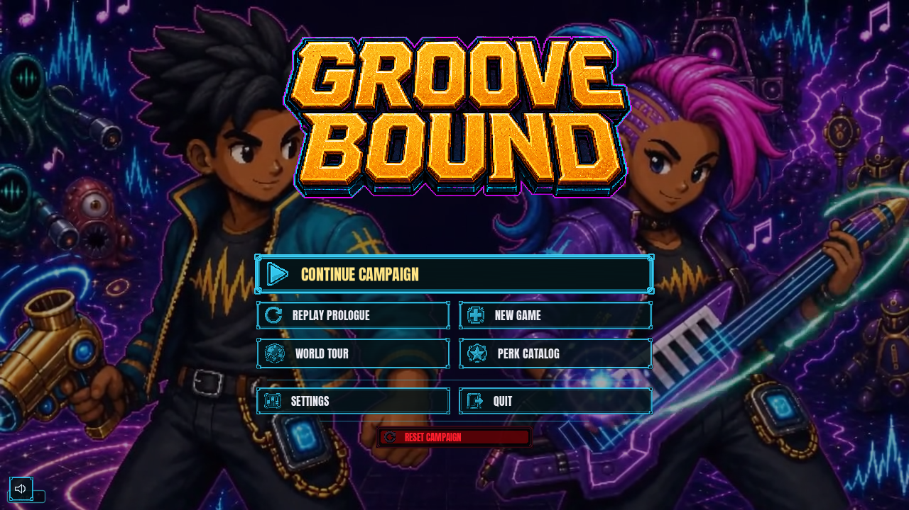
  </a>
</p>

<p align="center">
  <strong><a href="landing-page/assets/video/groove-bound-trailer-v1.mp4">▶ Watch the official 30-second trailer</a></strong>
</p>

Groove Bound combines manual movement and aiming with automatic instrument
attacks, persistent two-stage builds, musical reward chests, weapon fusions,
boss fights, and a route-based World Tour. Play as Joe or Lyra Vex, survive the
Break across Backbeat and the Orbit Line, then take that knowledge into eight
playable World Tour stages spanning Funk, Soul, Disco, and Jazz.

### What is playable in v0.9.6

- Two distinct playable Resonants: Joe and Lyra Vex.
- A complete two-stage narrative Prologue with six cinematic sequences.
- Four playable World Tour routes, each with two stages, unique mechanics,
  enemies, bosses, environments, music, grades, mastery, and permanent perks.
- 16 base weapons, eight supports, and 16 weapon fusions.
- Five difficulty profiles: Very Easy, Easy, Medium, Hard, and Super Hard.
- Keyboard, mouse, and gamepad support; remappable keyboard controls; aim assist;
  vibration; dead-zone control; four camera zoom levels; reduced flash and shake.
- Persistent profiles, run seeds, retry flow, adaptive music, reward chests,
  Encore rewards, and deterministic build offers.

---

## How to play

1. **Download and launch the game.** Use the macOS DMG, Windows x64 ZIP, or the
   platform-neutral `.love` file from the [latest release](https://github.com/raoniai/groovebound-2026/releases/latest).
2. **Set your comfort and challenge options.** Choose a difficulty and adjust
   aim assist, camera zoom, controller dead zone, vibration, hit flash, screen
   shake, fullscreen, and audio before or during a run.
3. **Choose Joe or Lyra Vex.** Joe is the sturdier control-focused choice;
   Lyra trades durability for speed, fire rate, and faster Resonance growth.
4. **Move, aim, and make space.** Your equipped instruments fire automatically.
   You decide where to stand, what to aim at, when to cross the arena, and which
   enemies or pickups are worth the risk.
5. **Collect Resonance XP.** Level gains become banked points and never have to
   interrupt play. Spend a point when you want to pause and choose one of three
   seeded upgrade offers, or enable the automatic level-up menu in Options.
6. **Shape your build.** Carry up to six weapons and four supports. Rank weapons,
   cover close and long range, and pair a rank-10 weapon with its matching
   support to prepare a fusion.
7. **Chase musical chests.** Chests pause combat and reveal one, three, or five
   rewards. An eligible fusion receives priority and replaces its base weapon
   while consuming the paired support and reopening build space.
8. **Break the bosses.** Watch their wind-ups, use the arena, and exploit each
   world's mechanic. Your health, Guard, weapons, supports, and upgrades carry
   from Stage 1 into Stage 2.
9. **Earn grades and mastery.** Clear World Tour routes, improve your score and
   route grade, unlock permanent perks, and retry failed worlds without being
   sent back through the Prologue.

### Controls

| Action | Keyboard and mouse | Gamepad |
|---|---|---|
| Move | `WASD` or arrow keys | Left stick |
| Aim | Mouse | Right stick |
| Confirm / select | `Enter` or `Space` | `A` / Cross |
| Back / cancel | `Esc` | `B` / Circle |
| Pause | `Esc` or `P` | Start / Options |
| Spend a banked level point | `L` or click the rank badge | `Y` / Triangle |
| Camera zoom | `-` / `+` | Options slider |
| Reroll a level-up offer | `R` | `X` / Square |
| Skip a level-up offer | `T` | `Y` / Triangle |
| Advance / skip cinematics | `Enter`, `Space`, arrows, or on-screen controls | `A`, `B`, D-pad, or `X` |

Keyboard bindings can be changed in **Settings → Keyboard Bindings**.

---

## Choose your Resonant

<p align="center">
  
  &nbsp;&nbsp;&nbsp;
  
</p>

<p align="center">
  
  
</p>

| | Joe | Lyra Vex |
|---|---|---|
| Play style | Durable control | Fast tempo and movement |
| Starting weapon | Kazoo Pistol | Keytar Chord |
| Signature trait | **Hold the Line** | **Stage Dive** |
| Strengths | Vitality, power, defense | Speed, fire rate, Resonance XP |

<details>
<summary><strong>Character movement sprites</strong></summary>
<br>
<p align="center">
  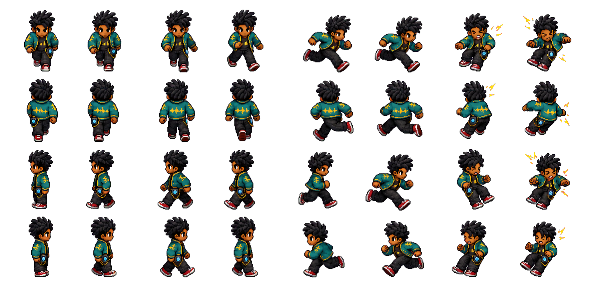
  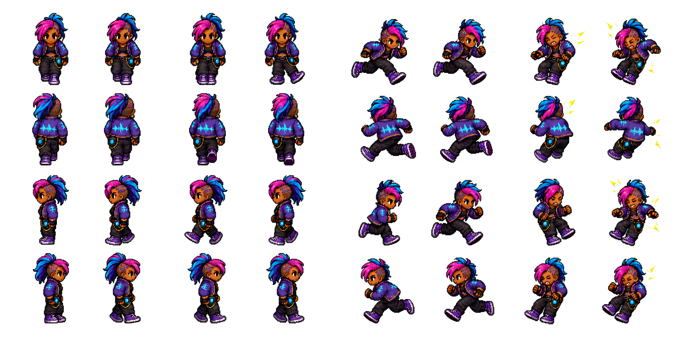
</p>
</details>

---

## The Prologue

Backbeat is a city where music is infrastructure. Rooftop venues, train lines,
street lights, and the defensive Pulse Tower share a living network called the
Resonance. When a cosmic chord plays backwards through every connected speaker,
instrument-machines descend and begin assembling an alien orchestra.

Joe and Lyra recover the **First Press**, a record whose groove hides a route
beneath the city. One build carries through both connected stages:

**Backbeat Streets → The Orbit Line**

<p align="center">
  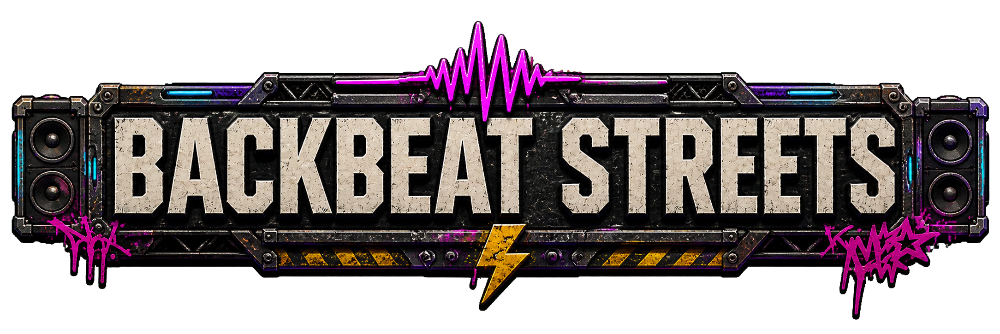
  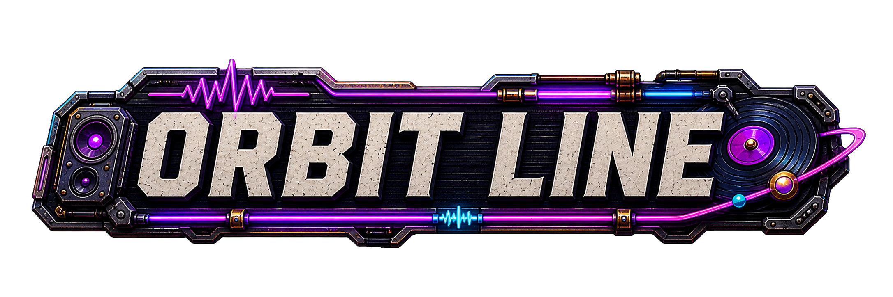
</p>

<p align="center">
  
  
</p>

<p align="center">
  
  
</p>

### Story cinematics

| Sequence | Video |
|---|---|
| Main menu panorama | [Watch MP4](landing-page/assets/video/main-menu.mp4) |
| Prologue | [Watch MP4](landing-page/assets/video/prologue.mp4) |
| Joe introduction | [Watch MP4](landing-page/assets/video/joe-intro.mp4) |
| Lyra Vex introduction | [Watch MP4](landing-page/assets/video/lyra-intro.mp4) |
| Orbit Line transition | [Watch MP4](landing-page/assets/video/stage2-transition.mp4) |
| Campaign ending | [Watch MP4](landing-page/assets/video/ending.mp4) |

The desktop build uses packaged OGV versions of these cinematics and falls back
to illustrated storyboards when video playback is unavailable.

---

## World Tour

<p align="center">
  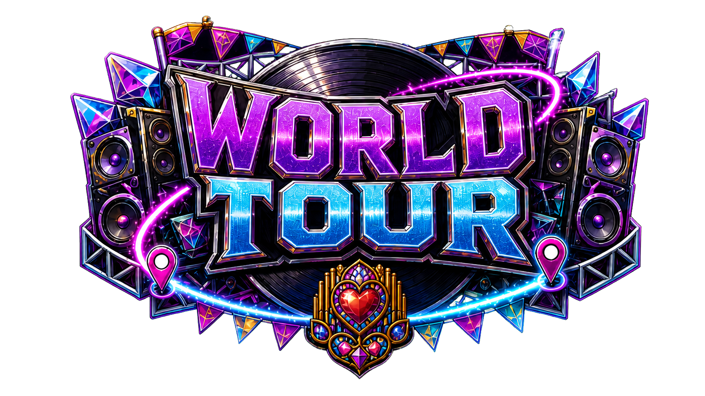
</p>

Clear two-stage routes, learn a world-specific rhythm mechanic, defeat two
bosses, earn a grade, and unlock permanent tour perks. The current release has
four complete routes; House and Techno remain visible as planned future worlds.

| Route | Stages | Core mechanic | Final boss |
|---|---|---|---|
| Funk — The Pocket District | The Pocket District → The Golden Afterparty | Catch the downbeat, hold the pocket, chain relays | Mothership of Funk |
| Soul — Velvet Chapel | The Velvet Nave → The Sanctuary Chorus | Charge Resonance, answer the call, recover through harmony | Velvet Titan |
| Disco — Mirrorball Metro | Mirrorball Concourse → The Prism Platform | Follow the spotlight and ride the prism relay | Prism Monarch |
| Jazz — Blue Note Borough | Blue Note Borough → Midnight Changes | Read phrases, react to changes, improvise under pressure | Midnight Maestro |

<p align="center">
  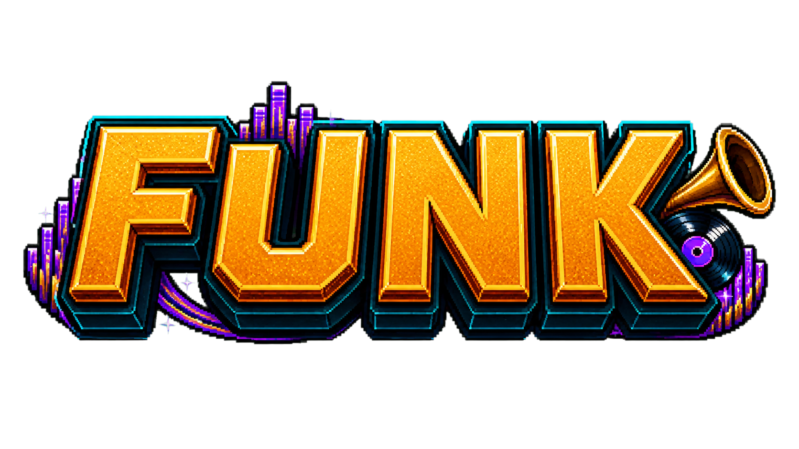
  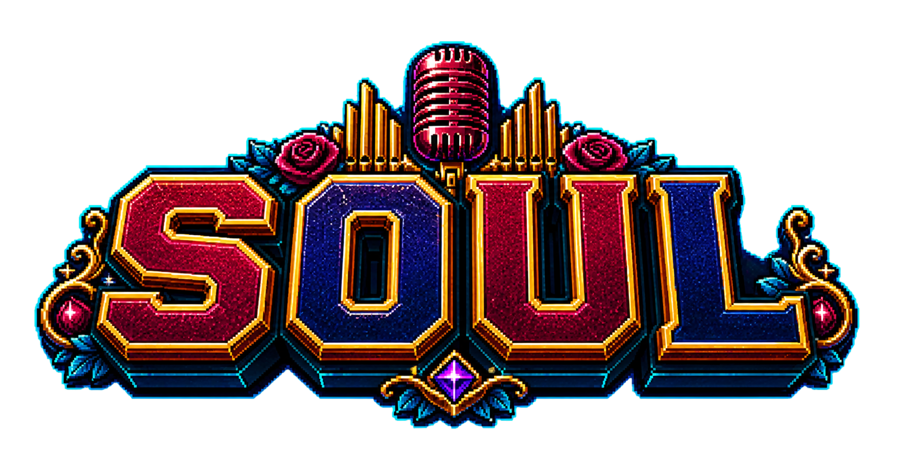
  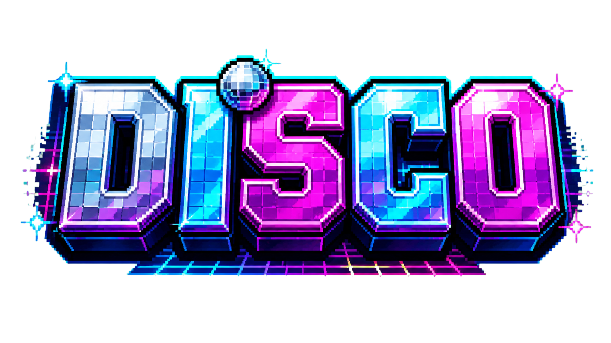
  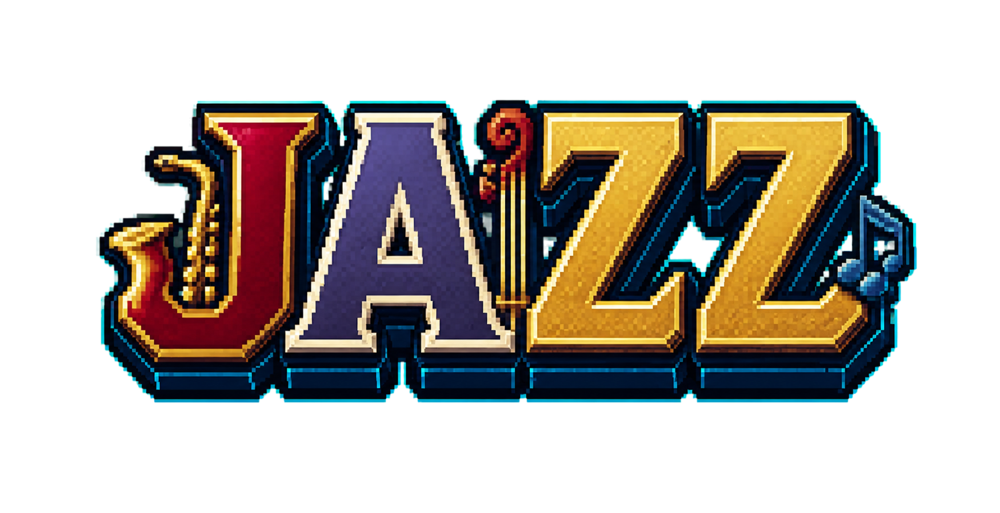
</p>

### Meet the tour headliners

<p align="center">
  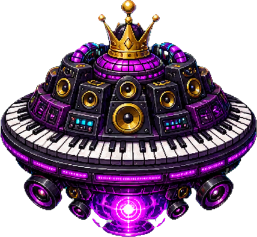
  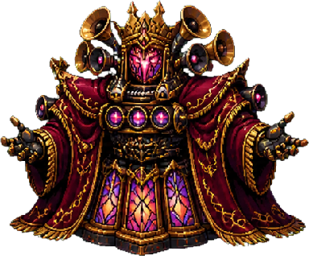
  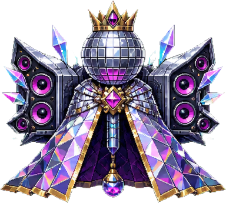
  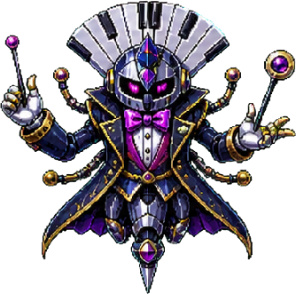
</p>

<details>
<summary><strong>World Tour mechanics, chests, grades, and interface sprites</strong></summary>
<br>
<p align="center">
  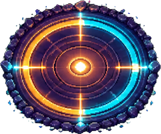
  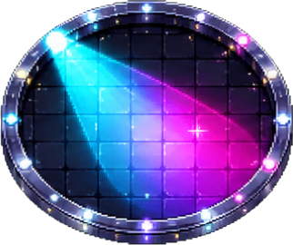
  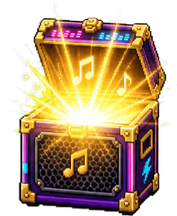
  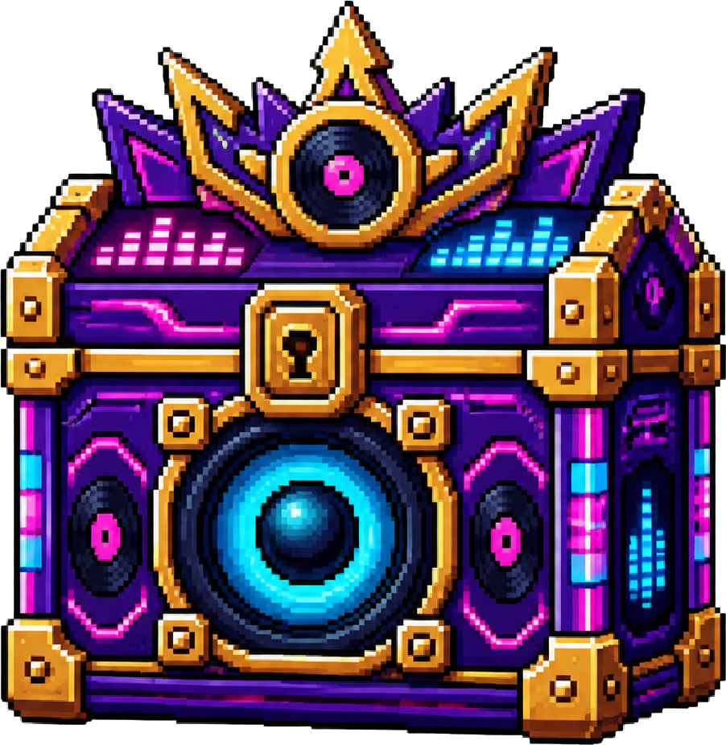
  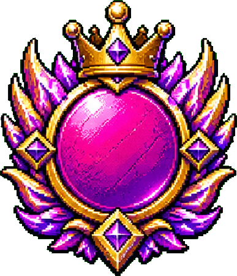
</p>
</details>

Browse the full current sprite collection in the
[World Tour asset library](landing-page/assets/world-tour/README.md) and the
[interactive Catalog](https://raoni.ai/groovebound/catalog.html).

---

## Build your set

Equipped instruments auto-target and fire, but build composition determines how
well you control lanes, crowds, elites, and bosses.

### 16 base weapons

<p align="center">
  
  
</p>

The arsenal spans aimed shots, piercing lanes, fans, radial control, orbitals,
boomerangs, bombs, beams, deployables, shockwaves, and broad projectile walls.
Each base weapon has ten ranks and an authored fusion pairing.

### Eight supports · 16 fusions

<p align="center">
  
  
  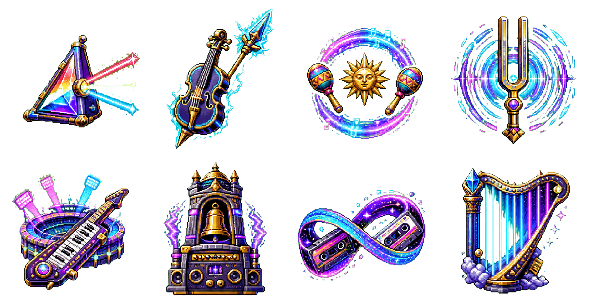
</p>

Bring a base weapon to rank 10 and own its matching support. The HUD will show
**Chest Ready**; collect a musical chest to perform the fusion. The evolved
weapon keeps the base weapon's active slot, consumes the support, and opens new
room in both parts of the build.

See the [Weapon Database](groove-bound/docs/WEAPON_DATABASE.md) and
[Fusion Guide](groove-bound/docs/WEAPON_EVOLUTION.md) for the complete recipes.

---

## Current build gallery

<p align="center">
  
  
</p>

<p align="center">
  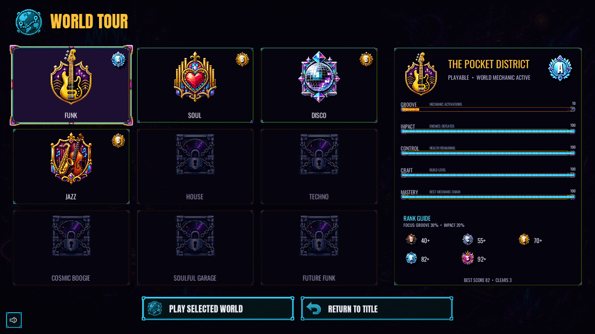
  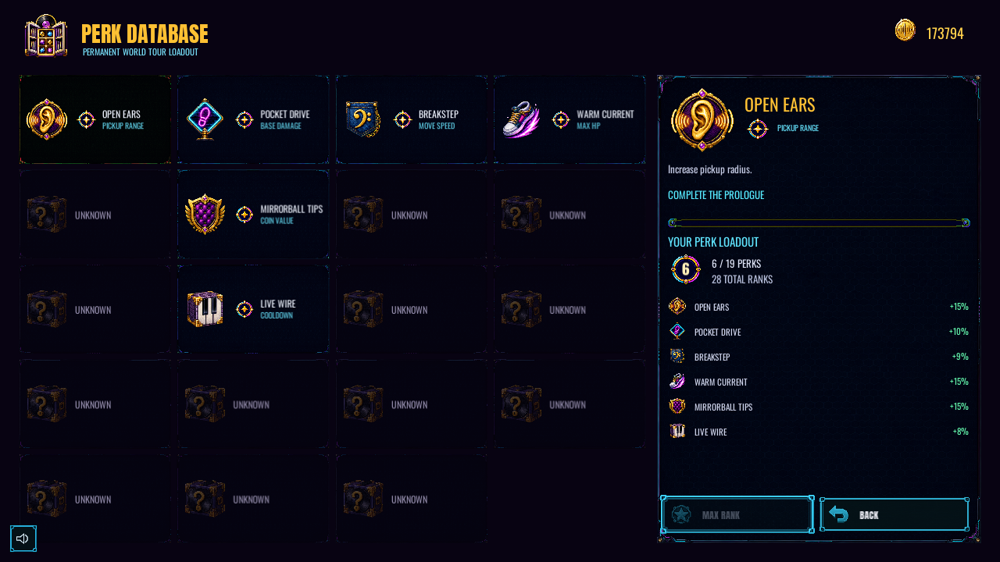
</p>

<p align="center">
  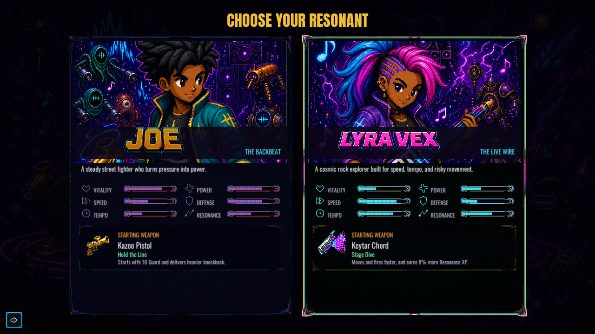
  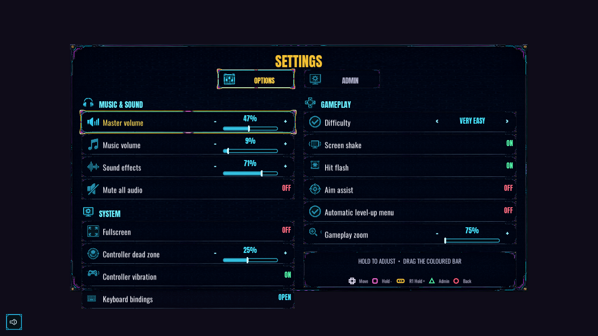
</p>

<p align="center">
  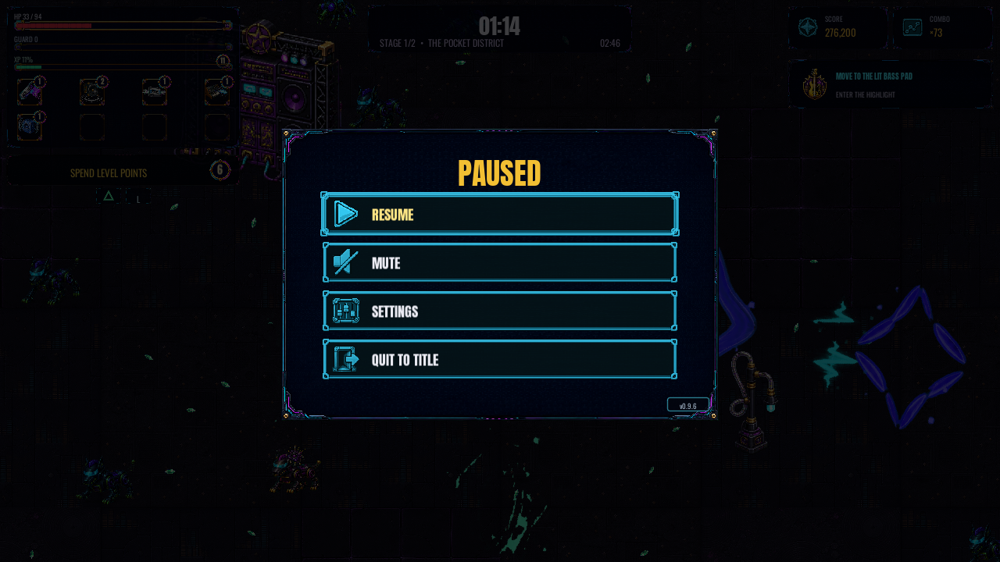
  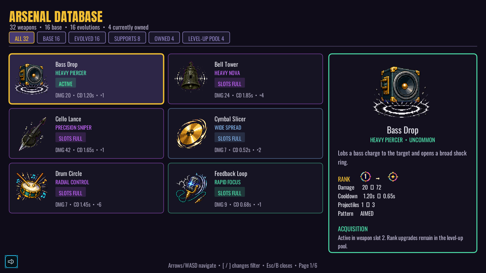
</p>

<p align="center">
  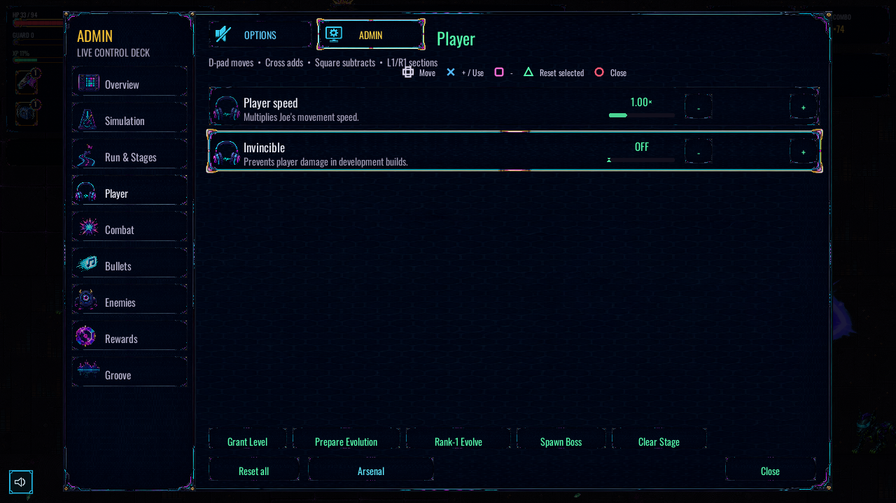
  
</p>

---

## Tips and tricks

- **Keep moving, but move with purpose.** Wide circles are safe until they drag
  you away from XP, chests, objectives, or a boss opening. Cut inward only when
  your path and escape lane are clear.
- **Spend level points on your schedule.** Points remain banked. Save them during
  a dense wave, then open the choice screen when you have room to think.
- **Build coverage before raw damage.** A close-range answer, a lane clearer,
  and a boss-focused weapon usually outperform several weapons with the same job.
- **Plan one fusion early.** Choose a base weapon and its matching support, then
  push that weapon toward rank 10. The pause guide shows missing ingredients.
- **Do not ignore chests after Chest Ready appears.** The next musical chest is
  your route to the evolved weapon; leaving it off-screen delays the power spike.
- **Use the world mechanic.** Funk pockets, Soul charge zones, Disco spotlights,
  and Jazz phrases multiply your effectiveness and build Encore progress.
- **Preserve health before Stage 2.** Your build and condition carry forward.
  A greedy first-stage finish can turn the second arena into a recovery run.
- **Read boss wind-ups, not only projectiles.** Bosses anchor briefly before their
  heavy patterns. Reposition during the warning instead of reacting after release.
- **Tune visibility to the fight.** Camera zoom, hit flash, screen shake, and aim
  assist can all be changed during a run without discarding progress.
- **Use Retry in World Tour.** A failed route can restart directly with the same
  character and launch setup; you do not need to replay the Prologue.

---

## Download

| Platform | Package | Start |
|---|---|---|
| macOS — Apple Silicon and Intel | [Groove-Bound-macOS.dmg](https://github.com/raoniai/groovebound-2026/releases/latest/download/Groove-Bound-macOS.dmg) | Open the DMG, drag Groove Bound to Applications, then launch it. |
| Windows 64-bit | [Groove-Bound-Windows-x64.zip](https://github.com/raoniai/groovebound-2026/releases/latest/download/Groove-Bound-Windows-x64.zip) | Extract the ZIP and run `Groove Bound.exe`. |
| Linux / LÖVE 11.5 | [groove-bound.love](https://github.com/raoniai/groovebound-2026/releases/latest/download/groove-bound.love) | Run `love groove-bound.love`. |

The macOS preview is ad-hoc signed rather than Apple-notarized. If macOS blocks
the first launch, Control-click **Groove Bound**, choose **Open**, and confirm.

Checksums and the Windows manifest are attached to the
[v0.9.6 release](https://github.com/raoniai/groovebound-2026/releases/tag/v0.9.6).

---

## Build from source

Install [LÖVE 11.5](https://love2d.org/), then:

```sh
git clone https://github.com/raoniai/groovebound-2026.git
cd groovebound-2026/groove-bound
make run
```

Run the project checks:

```sh
make test
make lint
make package
```

The canonical runtime is in [`groove-bound/`](groove-bound/). Its
[developer README](groove-bound/README.md) covers architecture, content,
packaging, tests, and contribution boundaries.

### v0.9.6 verification

- 432 automated tests passed locally and in CI.
- Zero lint findings across 194 Lua files.
- One deterministic `.love` payload feeds the macOS and Windows packages.
- Seven release assets carry GitHub SHA-256 digests.
- Package integrity, version parity, native boot markers, stable download routes,
  and the public site were verified for v0.9.6.

Physical Windows gameplay, prolonged unlocked-Mac play, full controller coverage,
and Apple notarization remain separate manual acceptance items.

### Project reference

- [First-Draft Canon](groove-bound/docs/FIRST_DRAFT_CANON.md)
- [Weapon Database](groove-bound/docs/WEAPON_DATABASE.md)
- [Fusion Guide](groove-bound/docs/WEAPON_EVOLUTION.md)
- [Admin Controls](groove-bound/docs/ADMIN_CONTROLS.md)
- [Generated Asset Provenance](groove-bound/assets/generated/PROVENANCE.md)
- [Video Provenance](groove-bound/assets/video/PROVENANCE.md)
- [Latest Version Handover](LATEST_VERSION_HANDOVER.md)

---

<p align="center">
  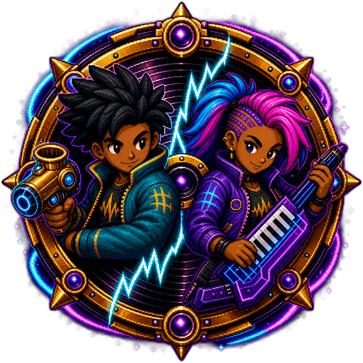
  &nbsp;&nbsp;&nbsp;
  
</p>

<p align="center">
  Created by <a href="https://www.linkedin.com/in/raonilima">Raoni Lima</a> ·
  <a href="https://raoni.ai/groovebound/">Visit the official site</a> ·
  <a href="https://github.com/raoniai/groovebound-2026/issues">Report an issue</a>
</p>
