<p align="center">
  
</p>

<p align="center">
  <strong>Restore rhythm to the universe.</strong><br>
  A bright urban-supernatural survival roguelike built with LÖVE.
</p>

<p align="center">
  <a href="https://github.com/raoniai/groovebound-2026/releases/latest/download/groove-bound.love">
    
  </a>
  <a href="https://github.com/raoniai/groovebound-2026/actions/workflows/ci.yml">
    
  </a>
  
  
</p>

<p align="center">
  <a href="#the-campaign">Campaign</a> ·
  <a href="#choose-your-resonant">Characters</a> ·
  <a href="#two-stages-one-build">Stages</a> ·
  <a href="#build-your-set">Arsenal</a> ·
  <a href="#download-and-play">Play</a> ·
  <a href="#development-reference">Development</a>
</p>

> [!IMPORTANT]
> This README describes the current **two-stage narrative campaign development
> preview**. The downloadable release may trail the source branch until the
> preview is merged and released. The platform-neutral
> `.love` package requires [LÖVE 11.5](https://love2d.org/).

---

## The campaign

Backbeat is a city where music is infrastructure. Rooftop venues, train lines,
street lights, and the defensive Pulse Tower all share a living network called
the Resonance.

Then the sky misses a beat.

A cosmic chord plays backwards through every connected speaker. Instrument
machines descend into the city, sampling its music and assembling an alien
orchestra. Joe and Lyra Vex answer the downbeat, break open the Static Baron,
and recover a strange record called the **First Press**. Its song is also a
map—one that leads beneath Backbeat to the abandoned Orbit Line.

<p align="center">
  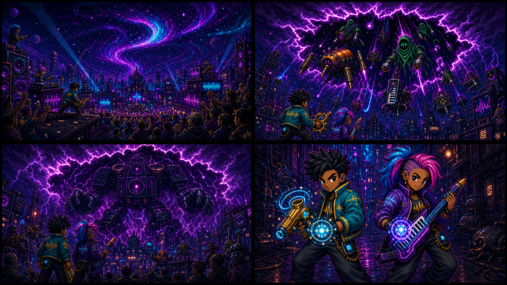
  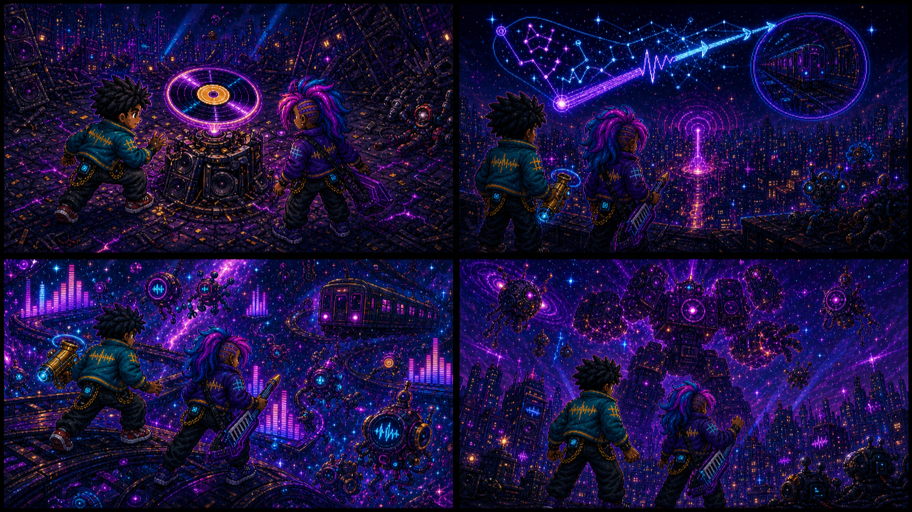
</p>

The playable flow is now:

**Title → Prologue → Character Selection → Character Intro → Backbeat Streets
→ Inter-stage Cutscene → The Orbit Line → Campaign Ending**

The supplied prologue and Joe-intro videos now play directly in the campaign,
mapped by filename. Clicking a playing video pauses or resumes it; when it ends,
its final frame holds behind Next and Replay actions. Every video scene retains
its illustrated storyboard as an automatic fallback.

Read the complete [first-draft canon](groove-bound/docs/FIRST_DRAFT_CANON.md).

---

## Choose your Resonant

<p align="center">
  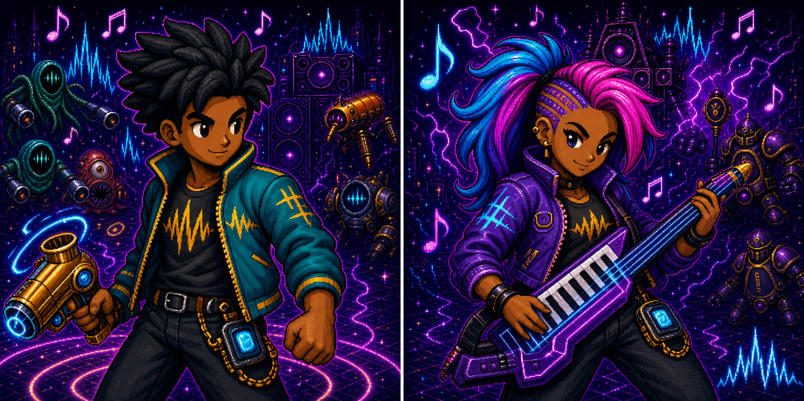
</p>

| | Joe — The Backbeat | Lyra Vex — The Live Wire |
|---|---|---|
| Style | Durable street guardian | Fast cosmic rock adventurer |
| Starting weapon | Kazoo Pistol | Keytar Chord |
| Signature trait | **Hold the Line** — starts with 18 Guard and stronger knockback | **Stage Dive** — moves and fires faster and earns more Resonance XP |
| Strengths | Vitality, power, defense | Speed, tempo, resonance |
| Trade-off | Slower firing tempo | Lower vitality and defense |

Both characters have four-direction idle, walk, high-speed run, and hurt/action
states. Walking now uses dedicated motion frames; sufficiently large speed
upgrades visibly switch the selected hero into their faster run cycle.

<p align="center">
  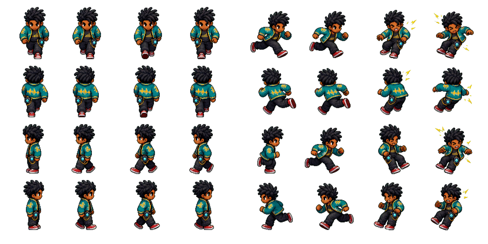
  
</p>

---

## Two stages, one build

Your complete weapon and support build carries forward between stages. Clearing
Backbeat restores part of your health, grants temporary Guard, and moves
directly into the illustrated Orbit Line transition.

### Stage 1 — Backbeat Streets

A supernatural concert district grounded by a subtle urban-grime floor, filled
with speaker stacks, service equipment,
road cases, light trusses, and the original invasion horde. Survive the
Metronome Guardian and bring down the Static Baron to recover the First Press.

### Stage 2 — The Orbit Line

A distinct cosmic transit arena with cosmic dust and embedded crystal detail,
energy rails,
alien speaker pylons, sealed gates, turntable consoles, orbital structures,
and an escalating instrument-machine orchestra.

<p align="center">
  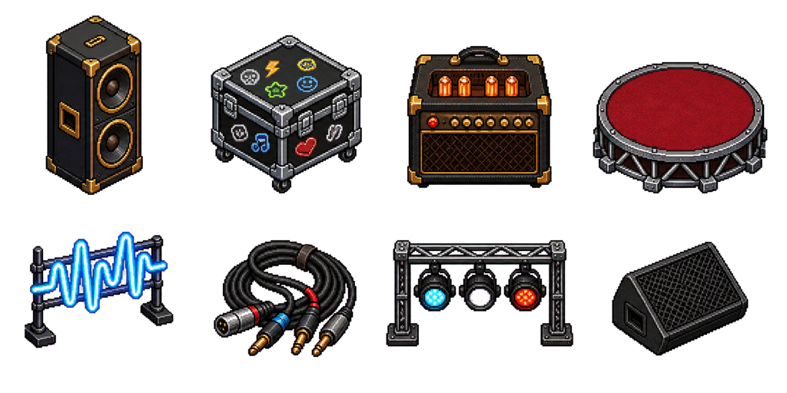
  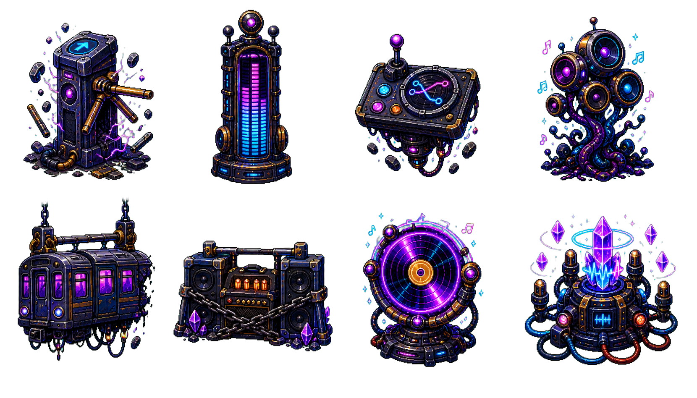
</p>

### Face two enemy families

<p align="center">
  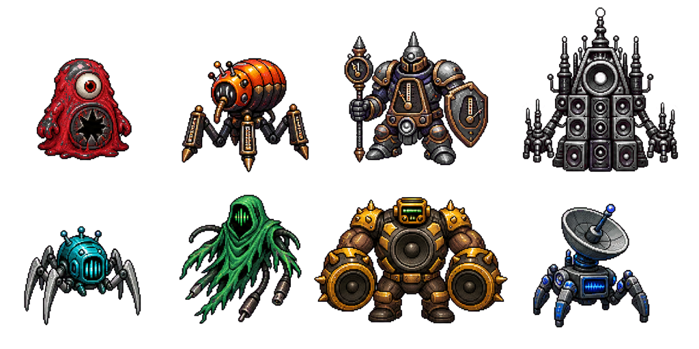
  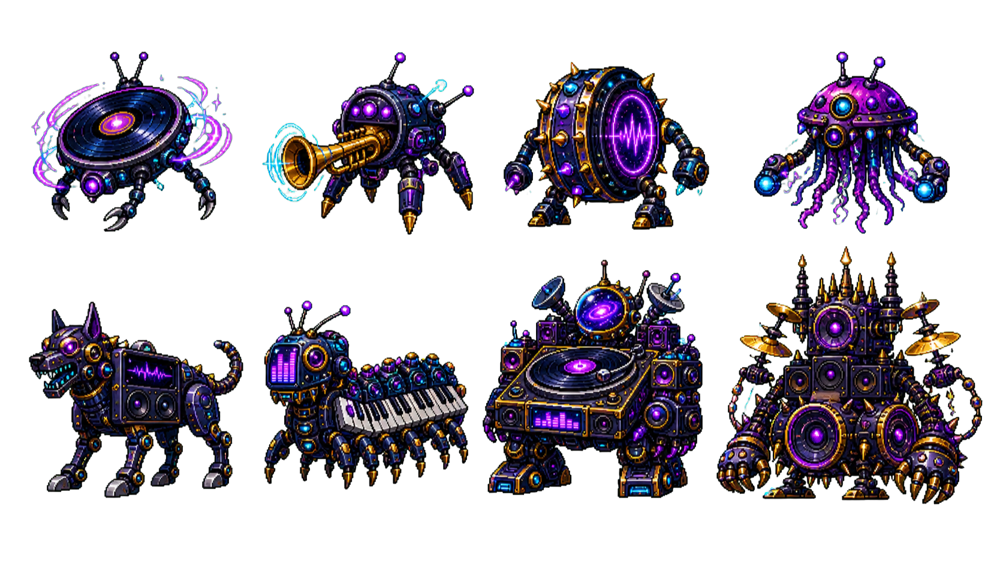
</p>

The Orbit Line introduces four normal enemies, two elites, a midboss, and a
megazord-scale final boss:

- Vinyl Drone, Trumpet Ray, Drum Wheel, and Theremin Jelly;
- elite Amp Hound and Keyboard Centipede;
- Turntable Sentinel midboss;
- Grand Orchestrator final boss.

Enemy behaviours now include chase, zigzag, charge, orbit, ranged note bolts,
resonance pulses, attack windups, contact attacks, and boss pressure patterns.
Difficulty increases naturally within each stage and rises again in Stage 2.

Both stages default to three minutes. Admin controls can independently set either
stage from 60 to 1,200 seconds and scale the campaign difficulty ramp.

---

## Build your set

Movement is manual; equipped instruments auto-target and fire. Every run is a
compact build-crafting puzzle:

1. Move, dodge, and control space.
2. Collect XP gems and trigger paused level-up choices.
3. Add weapons, raise ranks, equip supports, or take recovery and currency.
4. Build up to six active weapons and four supports.
5. Find a rare musical chest to fuse a ready rank-10 weapon and support recipe.
6. Carry the completed build into the Orbit Line and finish the campaign.

### 16 base weapons

Brass bursts, bass shockwaves, cymbal blades, feedback loops, drum pulses,
trumpet cones, vinyl sparks, synth waves, triangle tracers, cello lances,
orbiting maracas, tuning forks, keytar chords, bells, cassette echoes, and
laser-harp beams span seven firing behaviours.

<p align="center">
  
  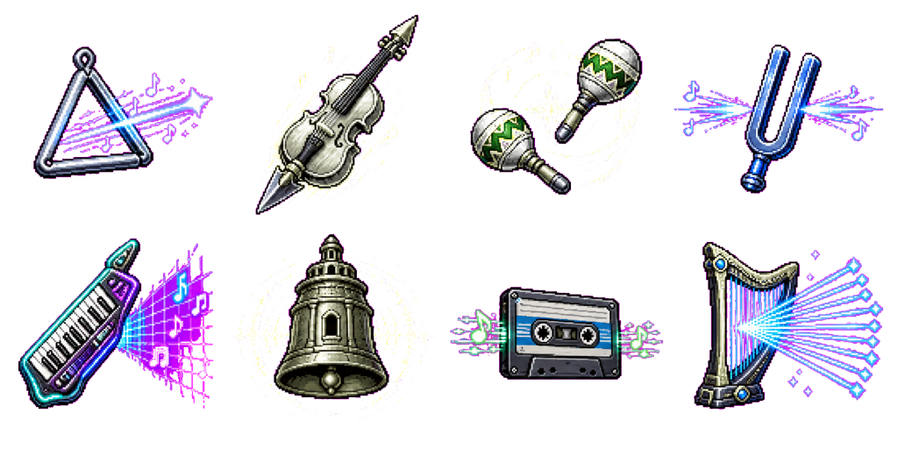
</p>

### 8 supports · 8 legendary fusions

Supports strengthen the live build and complete evolution recipes. Level-up
cards cannot evolve weapons: a rare musical chest rolls one, three, or five
automatic legal rewards and prioritizes any ready fusions. A fusion consumes
both ingredients, replaces the exact firing emitter, and reopens support and
weapon capacity.

<p align="center">
  
  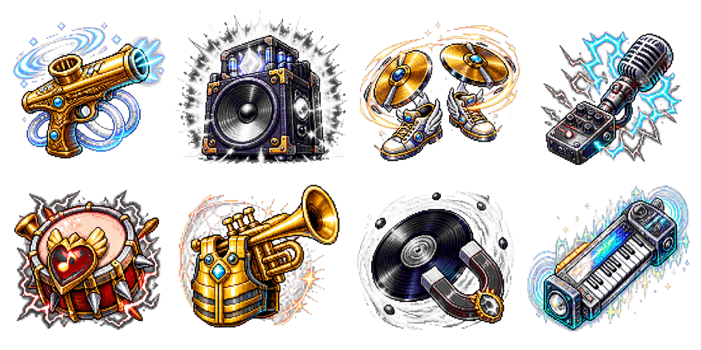
</p>

See the complete [Weapon Database](groove-bound/docs/WEAPON_DATABASE.md) and
[Evolution Guide](groove-bound/docs/WEAPON_EVOLUTION.md).

---

## Combat now reads like combat

Each base and evolved weapon now uses a related projectile silhouette rather
than sharing one recoloured bullet. Enemies flash when hit, receive directional
knockback, and burst into animated death effects. Contact attacks, note bolts,
and resonance pulses trigger player hurt frames, damage flashes, recoil,
screen shake, and optional controller vibration.

<p align="center">
  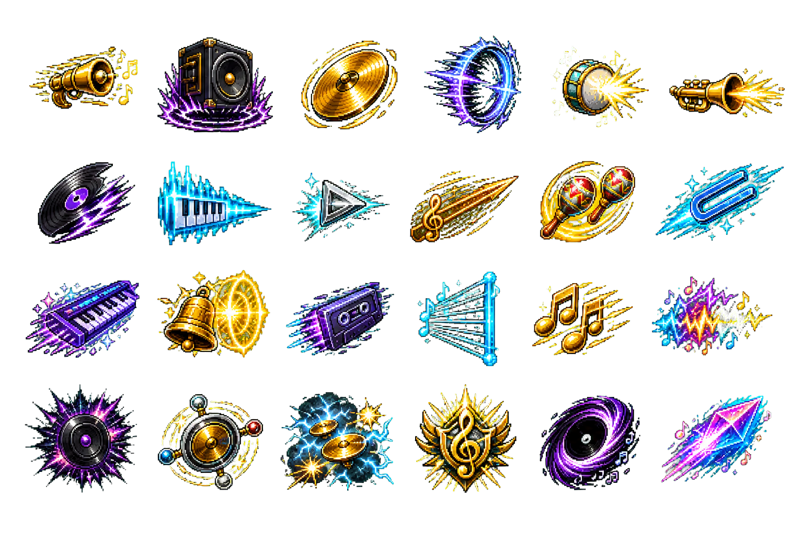
  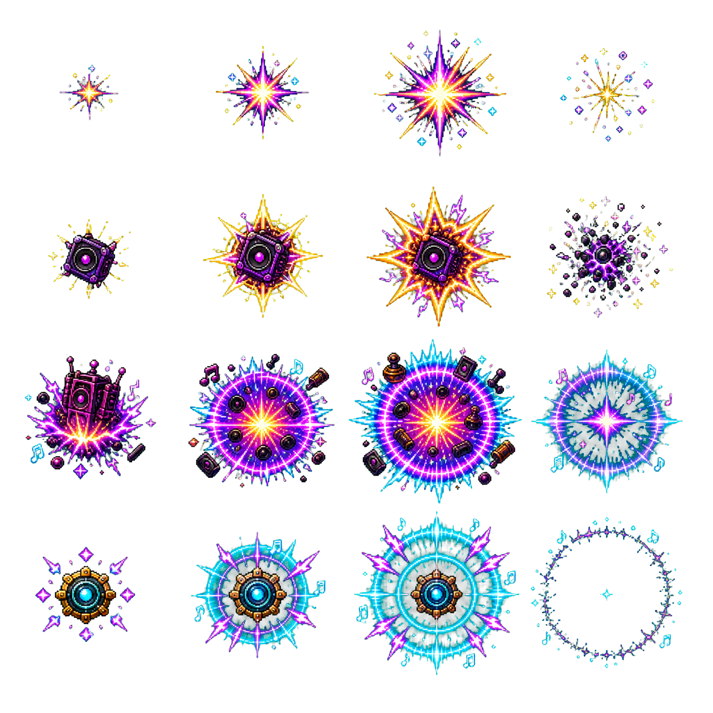
</p>

The active HUD presents health, Guard, XP, stage progress, countdown, complete
weapon and support racks, boss health, score, combo, and campaign notices with a
larger, clearer information hierarchy. `Tab` hides or restores the debug
overlay at any time.

---

## Download and play

### 1. Install LÖVE

Download **LÖVE 11.5** for macOS, Windows, or Linux from
[love2d.org](https://love2d.org/).

### 2. Download Groove Bound

<p>
  <a href="https://github.com/raoniai/groovebound-2026/releases/latest/download/groove-bound.love">
    
  </a>
  <a href="https://github.com/raoniai/groovebound-2026/releases/latest">
    
  </a>
</p>

### 3. Launch it

| Platform | How to launch |
|---|---|
| macOS | Open LÖVE, then drag `groove-bound.love` onto the LÖVE application. |
| Windows | Double-click `groove-bound.love`, or drag it onto `love.exe`. |
| Linux | Run `love groove-bound.love` from a terminal. |

### Controls

| Action | Keyboard | Gamepad |
|---|---|---|
| Move | `WASD` or arrow keys | Left stick |
| Confirm / choose | `Enter` or `Space` | `A` |
| Pause / resume | `Esc` or `P` | `Start` |
| Back / cancel | `Esc` | `B` |
| Navigate menus | Arrow keys | D-pad |
| Open Admin Controls | `F1` | Available from title/pause menus |
| Toggle debug overlay | `Tab` | — |

The Options screen includes persistent volume, feedback, fullscreen, aim
assist, deadzone, and conflict-checked keyboard rebinding controls.

---

## Current preview

<p align="center">
  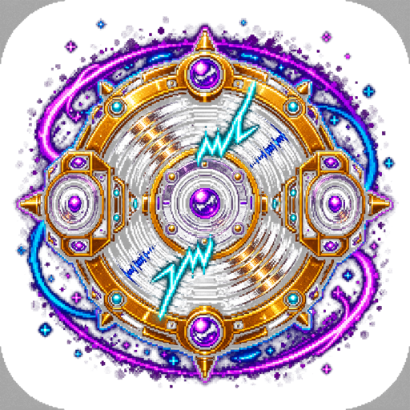
</p>

| System | Current build |
|---|---|
| Campaign | Filename-mapped videos with illustrated fallbacks across the two-stage story |
| Run structure | Two three-minute stages with build carryover and partial recovery |
| Characters | Joe and Lyra Vex with different stats, traits, weapons, and animation states |
| Arsenal | 16 base weapons, seven firing patterns, six weapon slots |
| Build crafting | Eight supports, four support slots, eight rank-10 fusion recipes |
| Stage 2 roster | Four normal enemies, two elites, one midboss, and one final boss |
| Combat feedback | Unique projectiles, hit sparks, explosions, death flicker, knockback, hurt reactions |
| Progression | Four XP-gem tiers, magnetized consumables, randomized level-up cards, and chest-only fusions |
| Interface | Larger type, clearer hierarchy, campaign HUD, Arsenal Database, Admin dashboard |
| Input | Keyboard, mouse, and gamepad menus with persistent options |
| Validation | 241 headless tests, Luacheck, content validation, package checks, video playback smoke, and CI boot smoke |

### Admin testing controls

The segmented Admin dashboard includes:

- independent Stage 1 and Stage 2 duration;
- difficulty escalation, player speed, invincibility, damage, fire rate,
  knockback, enemy speed/damage/density, XP, and pickup tuning;
- Grant Level, Prepare Evolution, Spawn Boss, and Clear Stage tools;
- an explicit toggle-gated rank-1 evolution shortcut for testing only.

Normal progression still requires a rank-10 weapon and its matching support.
See the [Admin Controls guide](groove-bound/docs/ADMIN_CONTROLS.md).

---

## Development reference

Run from source:

```sh
git clone https://github.com/raoniai/groovebound-2026.git
cd groovebound-2026/groove-bound
make run
```

Verification:

```sh
make test
make lint
make package
```

Project code lives in [`groove-bound/`](groove-bound/). The
[gameplay README](groove-bound/README.md) documents runtime architecture,
developer controls, and implementation ground rules.

### Lore, systems, and visual provenance

- [First-Draft Canon](groove-bound/docs/FIRST_DRAFT_CANON.md)
- [Weapon Database](groove-bound/docs/WEAPON_DATABASE.md)
- [Weapon Evolution Guide](groove-bound/docs/WEAPON_EVOLUTION.md)
- [Admin Controls](groove-bound/docs/ADMIN_CONTROLS.md)
- [Generated Visual Asset Register](groove-bound/assets/generated/PROVENANCE.md)
- [Stage 2 Visual Prompt Set](groove-bound/docs/STAGE2_VISUAL_PROMPTS.md)
- [Legacy Asset Register](groove-bound/assets/legacy/PROVENANCE.md)
- [Visual Research and Generation Plan](VISUAL_ASSET_RESEARCH_AND_GENERATION_PLAN.md)
- [Remake Execution Plan](REMAKE_EXECUTION_PLAN.md)

The first-draft campaign is deliberately structured so supplied video and
proper source audio can replace the current placeholders without rewriting the
campaign state. The next planned layers are canon and balance refinement,
cinematic video/audio, and the BeatClock groove system.

Bug reports and build feedback can be filed through
[GitHub Issues](https://github.com/raoniai/groovebound-2026/issues).
