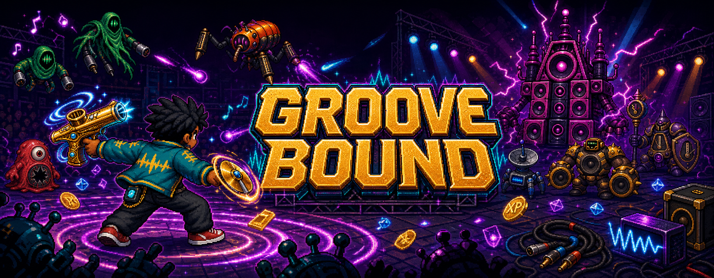

<p align="center">
  
</p>

<p align="center">
  <strong>Restore rhythm to the universe.</strong><br>
  A music-powered survival roguelike built with LÖVE.
</p>

<p align="center">
  <a href="https://github.com/raoniai/groovebound-2026/releases/latest/download/groove-bound.love">
    
  </a>
  <a href="https://github.com/raoniai/groovebound-2026/actions/workflows/ci.yml">
    
  </a>
  
</p>

> [!IMPORTANT]
> This is the **Stage 4 development preview**. The current download is a
> platform-neutral `.love` game package and requires
> [LÖVE 11.5](https://love2d.org/) to run.

## Enter the arena

Groove Bound is a fast, three-stage survival run where movement is manual and
the music fights automatically. Thread through a concert floor full of
sound-system monsters, collect XP gems, assemble a six-weapon set, and fuse
rank-10 instruments with the right support gear before the Static Baron ends
the show.

Every run is a compact build-crafting puzzle:

1. **Move** through the arena while your equipped weapons auto-target and fire.
2. **Collect** dropped XP gems and survive long enough to level up.
3. **Choose** a new weapon, weapon rank, support, recovery, guard, or currency.
4. **Fuse** a rank-10 base weapon with its matching support item.
5. **Clear three stages**, defeat the Metronome Guardian, and bring down the
   Static Baron.

## Download and play

### 1. Install LÖVE

Download **LÖVE 11.5** for macOS, Windows, or Linux from
[love2d.org](https://love2d.org/).

### 2. Download Groove Bound

<p>
  <a href="https://github.com/raoniai/groovebound-2026/releases/latest/download/groove-bound.love">
    
  </a>
  <a href="https://github.com/raoniai/groovebound-2026/releases/latest">
    
  </a>
</p>

### 3. Launch it

| Platform | How to launch |
|---|---|
| macOS | Open LÖVE, then drag `groove-bound.love` onto the LÖVE application. |
| Windows | Double-click `groove-bound.love`, or drag it onto `love.exe`. |
| Linux | Run `love groove-bound.love` from a terminal. |

## Controls

Attacks are automatic. Your job is positioning, dodging, collecting, and
choosing the right upgrades.

| Action | Keyboard | Gamepad |
|---|---|---|
| Move | `WASD` or arrow keys | Left stick |
| Confirm / choose | `Enter` or `Space` | `A` |
| Pause / resume | `Esc` or `P` | `Start` |
| Back / cancel | `Esc` | `B` |
| Navigate menus | Arrow keys | D-pad |
| Open Admin Controls | `F1` | Available from title/pause menus |

The Options screen includes persistent volume, feedback, fullscreen, aim-assist,
deadzone, and conflict-checked keyboard rebinding controls.

## Build your set

### 16 base weapons

From brass bursts and bass shockwaves to orbiting maracas and laser-harp
volleys, the arsenal spans seven distinct firing behaviours.

<p align="center">
  
  
</p>

### 8 supports · 8 legendary fusions

Supports strengthen the current build and complete evolution recipes. Reach
rank 10 with the matching base weapon to unlock a fusion choice; the fusion
consumes both ingredients, replaces the firing emitter, and reopens the support
slot.

<p align="center">
  
  
</p>

See the complete [Weapon Database](groove-bound/docs/WEAPON_DATABASE.md) and
[Evolution Guide](groove-bound/docs/WEAPON_EVOLUTION.md).

## Face the noise

Eight enemy silhouettes drive distinct chase, zigzag, charge, ranged, miniboss,
and final-boss encounters. Obstacles and concert props turn the arena into a
stage rather than an empty field.

<p align="center">
  
</p>

## What is in this preview?

| System | Current build |
|---|---|
| Run structure | Three 60-second stages with countdowns and phase-clear transitions |
| Arsenal | 16 base weapons, seven firing patterns, six weapon slots |
| Build crafting | Eight supports, four support slots, eight rank-10 fusion recipes |
| Enemies | Eight variants, a miniboss, and a final boss |
| Progression | XP gems, paused three-card choices, reroll, bounded skip reward |
| Combat feedback | Health, guard, XP, score, combo, boss health, stage and build HUD |
| Reference tools | Searchable Arsenal Database and bounded Admin dashboard |
| Input | Keyboard, mouse, and gamepad menu support with persistent options |
| Validation | Headless unit suite, Luacheck, content validation, and LÖVE boot smoke in CI |

## Run from source

```sh
git clone https://github.com/raoniai/groovebound-2026.git
cd groovebound-2026/groove-bound

make run
```

Developer checks:

```sh
make test
make lint
make package
```

Project code lives in [`groove-bound/`](groove-bound/). The
[gameplay README](groove-bound/README.md) documents the runtime architecture,
developer controls, and implementation ground rules.

## Visual direction and provenance

Groove Bound combines retained legacy floor/SFX material with original generated
pixel-art atlases for the player, enemies, weapons, supports, fusions, and arena
props. Source images, production mappings, generation notes, and rights
boundaries are recorded in:

- [Generated visual asset register](groove-bound/assets/generated/PROVENANCE.md)
- [Legacy asset register](groove-bound/assets/legacy/PROVENANCE.md)
- [Visual research, acquisition plan, and complete sprite prompt library](VISUAL_ASSET_RESEARCH_AND_GENERATION_PLAN.md)

## Development status

The Stage 1–4 vertical slice is playable. The next planned layer is the
BeatClock and groove system, followed by expansion into the longer
content-and-balance slice described in the
[remake execution plan](REMAKE_EXECUTION_PLAN.md).

Bug reports and build feedback can be filed through
[GitHub Issues](https://github.com/raoniai/groovebound-2026/issues).
