<p align="center">
  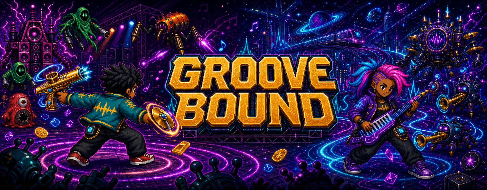
</p>

<p align="center">
  <strong>Restore rhythm. Survive the Break.</strong><br>
  A music-powered survival roguelike built with LÖVE 11.5.
</p>

<p align="center">
  <a href="https://github.com/raoniai/groovebound-2026/releases/latest/download/Groove-Bound-Windows-x64.zip">
    
  </a>
  <a href="https://github.com/raoniai/groovebound-2026/releases/latest/download/Groove-Bound-macOS.dmg">
    
  </a>
  <a href="https://github.com/raoniai/groovebound-2026/releases/tag/v0.8.1">
    
  </a>
  <a href="https://github.com/raoniai/groovebound-2026/actions/workflows/ci.yml">
    
  </a>
</p>

<p align="center">
  <a href="#when-the-sky-misses-a-beat">Story</a> ·
  <a href="#choose-your-resonant">Resonants</a> ·
  <a href="#two-stages-one-build">Stages</a> ·
  <a href="#build-your-set">Arsenal</a> ·
  <a href="#see-the-current-build">Gallery</a> ·
  <a href="#download-and-play">Download</a> ·
  <a href="#build-from-source">Development</a>
</p>

---

## When the sky misses a beat

Backbeat is a city where music is infrastructure. Rooftop venues, train lines,
street lights, and the defensive Pulse Tower all share a living network called
the Resonance.

Then a cosmic chord plays backwards through every connected speaker.
Instrument-machines descend, sampling the city and assembling an alien
orchestra. Joe and Lyra Vex answer the downbeat, recover a strange record called
the **First Press**, and follow its hidden route beneath Backbeat into the
abandoned Orbit Line.

<p align="center">
  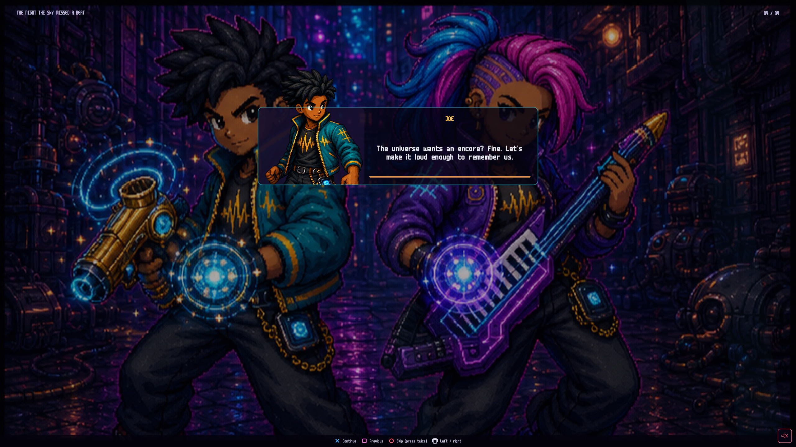
</p>

The current campaign flows through:

**Title → Prologue → Character Selection → Character Intro → Backbeat → Stage 2
Transition → Orbit Line → Campaign Ending**

Six runtime cinematics carry the story, with illustrated storyboard fallbacks
when video playback is unavailable. Your weapons, supports, health, and Guard
carry between both playable stages.

<p align="center">
  
  
  
  
  
</p>

Read the complete [first-draft canon](groove-bound/docs/FIRST_DRAFT_CANON.md).

---

## Choose your Resonant

<p align="center">
  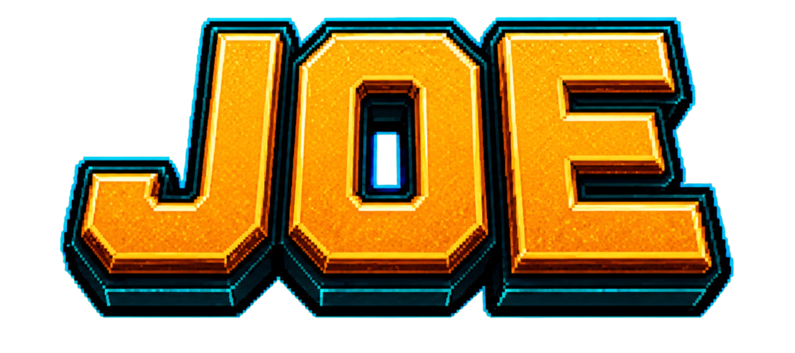
  &nbsp;&nbsp;&nbsp;
  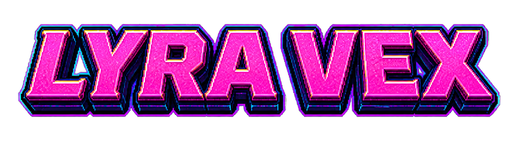
</p>

<p align="center">
  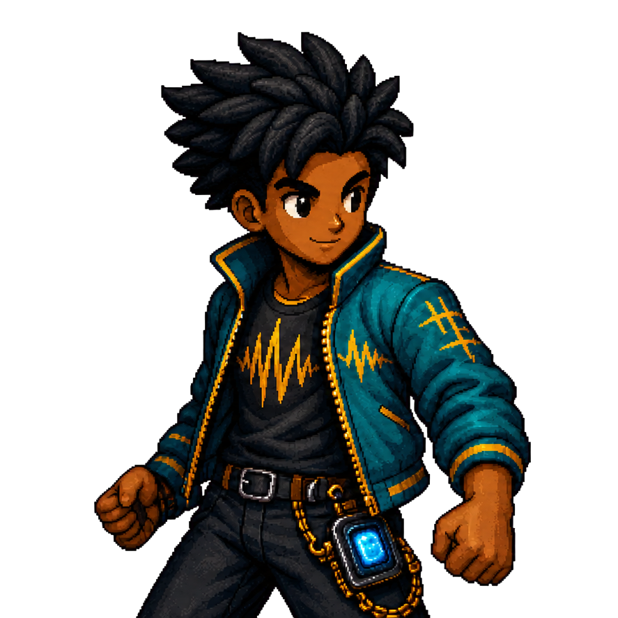
  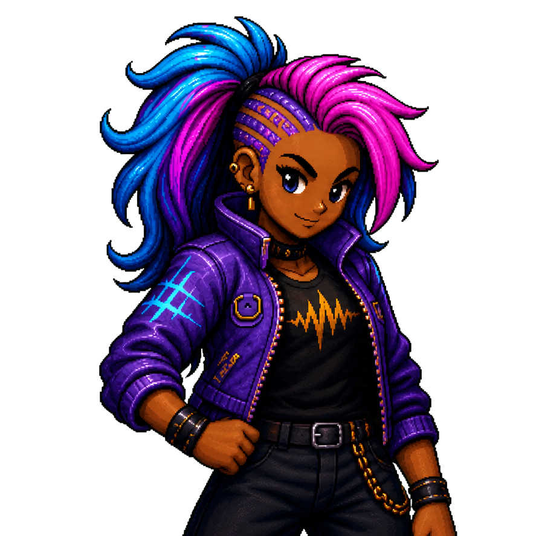
</p>

| | Joe | Lyra Vex |
|---|---|---|
| Play style | Durable control | Fast tempo and movement |
| Starting weapon | Kazoo Pistol | Keytar Chord |
| Signature trait | **Hold the Line** | **Stage Dive** |
| Strengths | Vitality, power, defense | Speed, fire rate, Resonance XP |

Both characters use movement-speed-driven animation, distinct stats, traits,
weapons, portrait art, dialogue, and introduction cinematics.

---

## Two stages, one build

### Backbeat

Protect Pulse Tower through a concert district filled with speaker stacks,
service equipment, road cases, light trusses, and the first machine invasion.
Survive the Metronome Guardian and bring down the Static Baron to recover the
First Press.

<p align="center">
  
</p>

### The First Press

The record is a map pretending to be music. Its groove encodes a route from
Backbeat to a dead transit system still broadcasting far below the city.

<p align="center">
  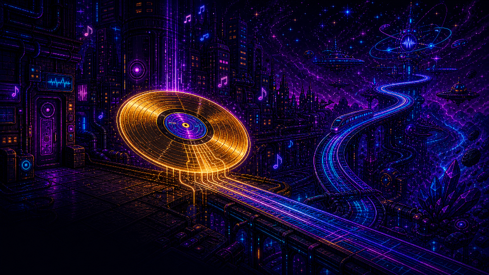
</p>

### Orbit Line

Carry the same build into an alien transit arena of energy rails, crystal dust,
sealed gates, turntable consoles, and an escalating instrument-machine
orchestra. Face the Turntable Sentinel before the Grand Orchestrator assembles.

<p align="center">
  
</p>

Both stages default to three minutes. Admin controls can independently tune each
stage from 60 to 1,200 seconds and adjust the campaign difficulty ramp.

---

## Build your set

Movement is manual. Equipped instruments auto-target and fire, turning every run
into a compact build-crafting puzzle:

1. Move, dodge, and control space.
2. Collect Resonance XP and choose from seeded three-card offers.
3. Build up to six weapons and four supports.
4. Open musical chests for one, three, or five concealed reward reels.
5. Fuse a rank-10 weapon with its matching support.
6. Carry the finished set into the Orbit Line and end the campaign.

### 16 base weapons

<p align="center">
  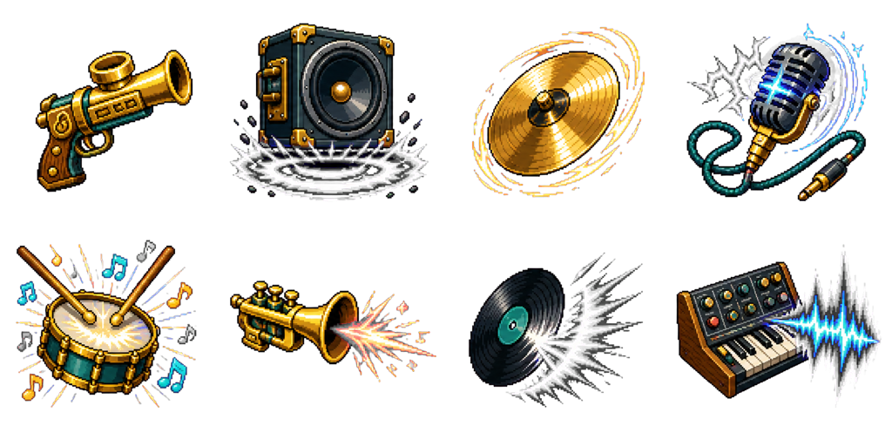
  
</p>

Brass bursts, bass shockwaves, cymbal blades, feedback loops, vinyl sparks,
synth waves, keytar chords, bells, cassette echoes, and laser-harp beams span
seven firing behaviours.

### 8 supports · 8 legendary fusions

<p align="center">
  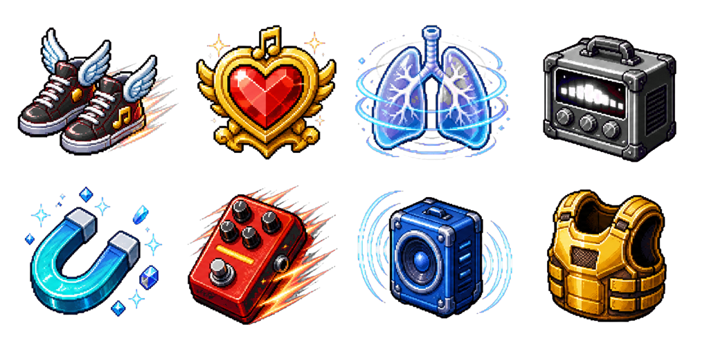
  
</p>

A fusion consumes both ingredients, replaces the exact weapon emitter, and
reopens weapon and support capacity. Level-up cards cannot bypass the recipe;
normal evolution stays chest-only.

Explore the [Weapon Database](groove-bound/docs/WEAPON_DATABASE.md) and
[Evolution Guide](groove-bound/docs/WEAPON_EVOLUTION.md).

---

## See the current build

<p align="center">
  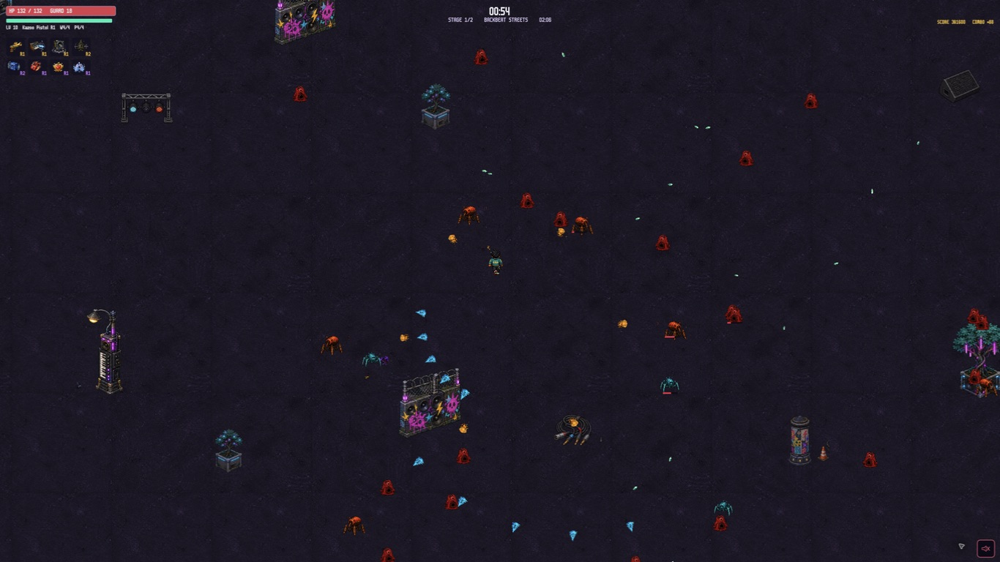
  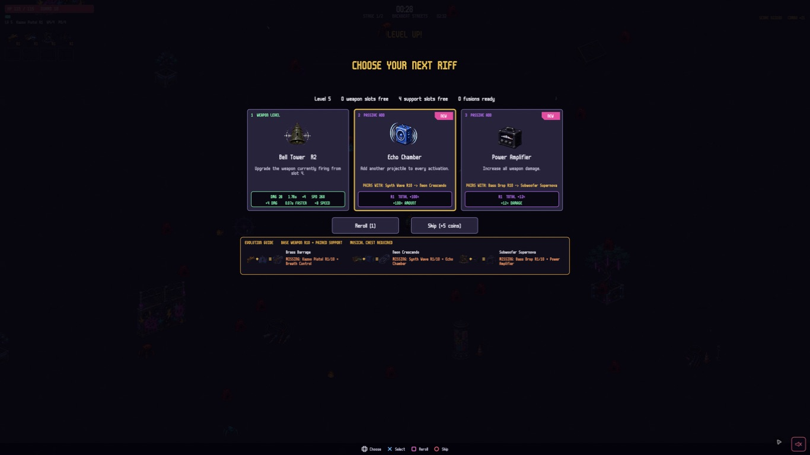
</p>

<p align="center">
  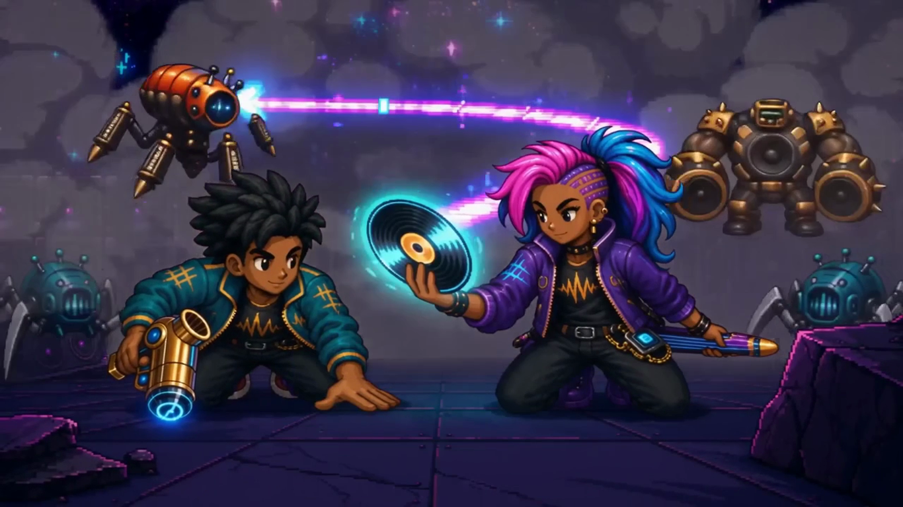
  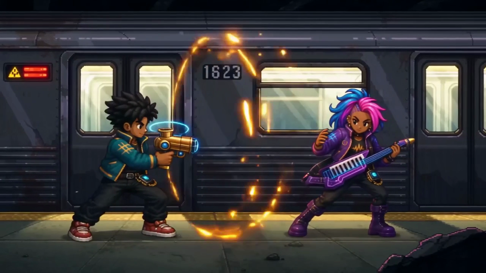
</p>

The v0.8.1 preview includes camera zoom from 75% to 150%, keyboard/mouse and
gamepad support, persistent options, aim assistance, rebindings, vibration,
flash and shake controls, adaptive music, cutscene mute, a transparent campaign
HUD, chest reward reels, and a complete Arsenal database.

---

## Download and play

### Windows x64

<p>
  <a href="https://github.com/raoniai/groovebound-2026/releases/latest/download/Groove-Bound-Windows-x64.zip">
    
  </a>
</p>

Extract the complete **Groove Bound** folder, keep the executable and DLLs
together, then launch **Groove Bound.exe**. LÖVE does not need to be installed.
The preview is unsigned, so Windows Defender SmartScreen may ask you to choose
**More info → Run anyway** on first launch. Validate the ZIP against the
checksums in the GitHub release before bypassing that warning.

### macOS

<p>
  <a href="https://github.com/raoniai/groovebound-2026/releases/latest/download/Groove-Bound-macOS.dmg">
    
  </a>
  <a href="https://github.com/raoniai/groovebound-2026/releases/latest">
    
  </a>
</p>

Open the DMG, drag **Groove Bound** into **Applications**, and launch the app.
The universal build includes LÖVE 11.5 and supports Apple Silicon and Intel Macs.

The preview is ad-hoc signed rather than Apple-notarized. If macOS blocks the
first launch, Control-click **Groove Bound**, choose **Open**, then confirm.

### Linux

Install [LÖVE 11.5](https://love2d.org/) and download the
[platform-neutral `.love` build](https://github.com/raoniai/groovebound-2026/releases/latest/download/groove-bound.love).

| Platform | Launch |
|---|---|
| Linux | Run `love groove-bound.love`. |

### Controls

| Action | Keyboard | Gamepad |
|---|---|---|
| Move | `WASD` or arrow keys | Left stick |
| Aim | Mouse or right stick | Right stick |
| Confirm | `Enter` or `Space` | `A` |
| Back / cancel | `Esc` | `B` / Circle |
| Skip cutscene | On-screen skip control | `B` / Circle |
| Pause | `Esc` or `P` | Start |
| Camera zoom | `-` / `+` | Settings slider |
| Admin controls | `F1` | Title or pause menu |
| Debug overlay | `Tab` | — |

---

## Build from source

```sh
git clone https://github.com/raoniai/groovebound-2026.git
cd groovebound-2026/groove-bound
make run
```

Verify the runtime:

```sh
make test
make lint
make package
```

The canonical Lua/LÖVE runtime lives in [`groove-bound/`](groove-bound/). Its
[developer README](groove-bound/README.md) explains the architecture, controls,
packaging, and contribution ground rules.

### Current verification

- 353 automated tests passing.
- 0 Luacheck warnings or errors across 172 files.
- Package integrity and forbidden-source checks passing.
- Windows x64 ZIP, executable branding, runtime manifest, fused payload, and packaged CI bootstrap verified.
- Universal macOS app, icon, signature, DMG checksum, and packaged boot verified.
- GitHub CI passing on the release branch.

Automated checks do not replace the remaining full campaign, physical
controller, and final listening QA for this development preview.

### Project reference

- [First-Draft Canon](groove-bound/docs/FIRST_DRAFT_CANON.md)
- [Weapon Database](groove-bound/docs/WEAPON_DATABASE.md)
- [Weapon Evolution Guide](groove-bound/docs/WEAPON_EVOLUTION.md)
- [Admin Controls](groove-bound/docs/ADMIN_CONTROLS.md)
- [Generated Asset Provenance](groove-bound/assets/generated/PROVENANCE.md)
- [Latest Version Handover](LATEST_VERSION_HANDOVER.md)

---

<p align="center">
  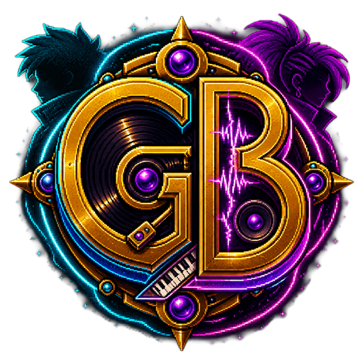
</p>

<p align="center">
  Created by <a href="https://www.linkedin.com/in/raonilima">Raoni Lima</a> ·
  <a href="https://github.com/raoniai/groovebound-2026/issues">Report an issue</a>
</p>
