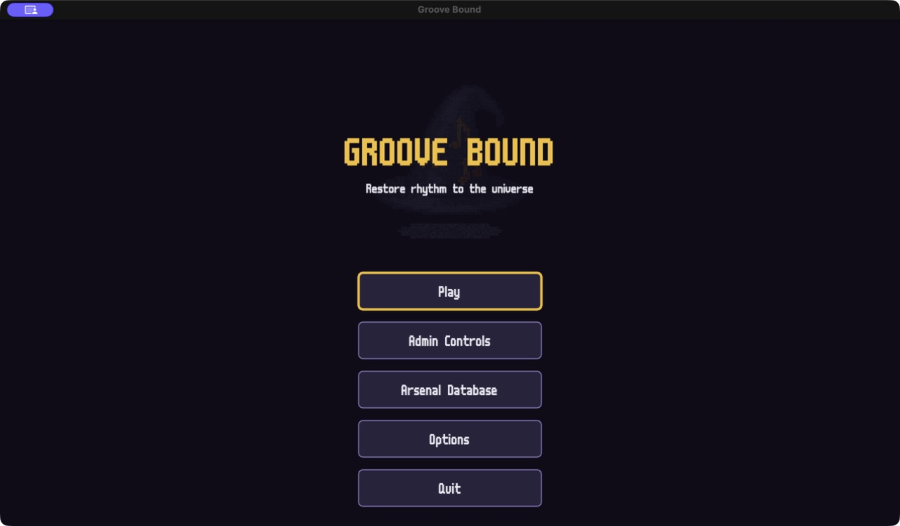
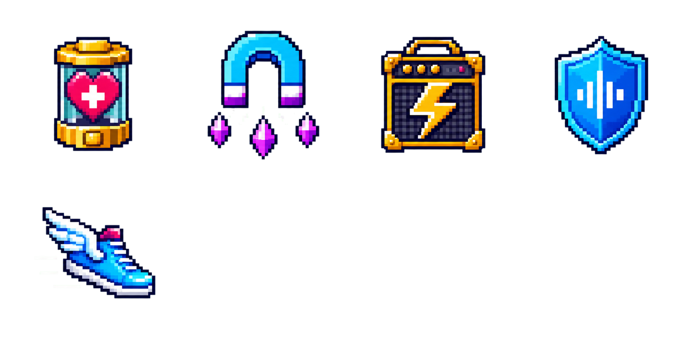
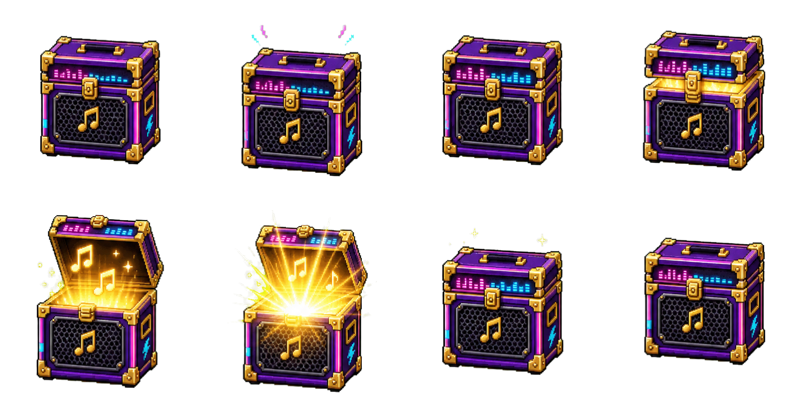
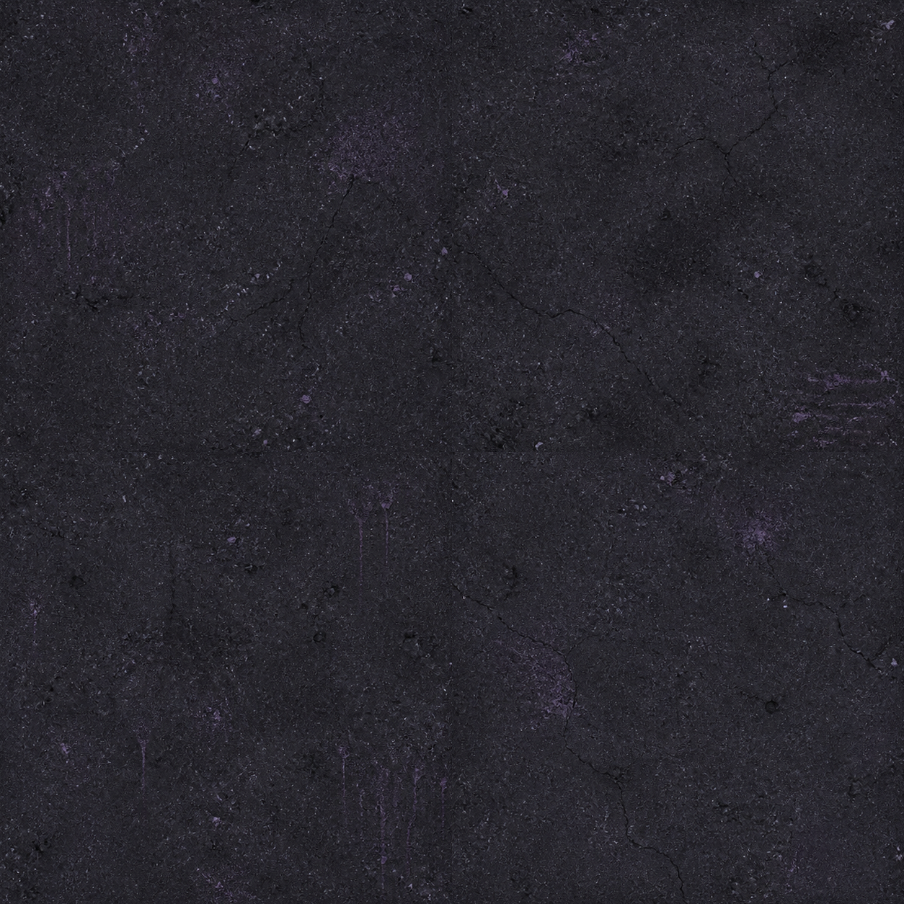

# Groove Bound (remake)

A survival roguelike where the groove is the game. This local copy was
restored from clean-remake PR head `fe79d6f` and is governed by
[`../REMAKE_EXECUTION_PLAN.md`](../REMAKE_EXECUTION_PLAN.md). The old
prototypes remain GitHub references; they are not part of this runtime tree.

This is a development build with a complete first-draft two-stage narrative
campaign. Both stages now default to three minutes and remain independently
adjustable from 60 to 1,200 seconds in the Admin dashboard. The GitHub release
is a public development preview, not a final production build.

## Playable slice

The current build now includes:

- a supplied looping main-menu video behind the separate logo and controls;
  filename-mapped prologue, Joe-intro and Lyra-intro videos with click-to-pause,
  Skip, fade-in, and an automatic two-second final-frame fade to black; every
  scene retains its illustrated fallback;
- an illustrated prologue, character intros, inter-stage scene, and ending with
  word-by-word dialogue that waits for confirmation, plus large left-side
  Joe/Lyra portraits whose heads break above the dialogue panel while their
  bodies remain cropped inside it;
- a full-screen title flow with a separate transparent logo, readable central
  menu lane, and a looping world panorama that frames Joe, Lyra, both stages,
  enemies, bosses, and music-powered landmarks around the interface;
- Joe and Lyra Vex with distinct stats, passive traits, starting weapons, and
  directional idle, walk, high-speed run, and hurt animations;
- two stage-specific environments and sixteen enemy variants;
- validated timed enemy waves that spawn continuously until replaced by the
  next wave, deterministic edge spawning, solid obstacles, and decorative
  arena elements;
- 16 base weapons, seven distinct firing patterns, auto-targeting and
  auto-fire;
- pooled projectiles, enemies, four sprite-only XP-gem tiers, magnetized rare
  consumables, and non-magnetizable musical reward chests;
- damage, contact damage, invulnerability frames, death, and drops;
- difficulty-scaled gem showers that preserve each enemy's exact XP value,
  gem attraction, multi-threshold XP and a paused three-card choice every level;
- seeded randomized offers with immediate anti-repeat protection, guaranteed
  new-weapon variety while slots are open, and owned-rank cards when both
  inventories are full;
- illustrated new-weapon, owned-rank, passive, heal, guard and coin decisions;
- one reroll and a bounded skip reward;
- four support slots and eight live stat-enhancing support items;
- eight rank-10 weapon + support fusion recipes that can only resolve through chests;
- animated one-, three-, or five-reward chest luck rolls that prioritize every
  currently eligible evolution, visibly settle each reel, and show the exact
  rewards before returning to combat;
- a visible chest-ready evolution notification and high-contrast pause guide;
- optional on-card evolution recipes and a missing-requirements guide,
  controlled from Admin → Rewards;
- an atomic fusion transaction that consumes both ingredients, replaces the
  exact firing emitter, reopens the support slot, and expands weapon capacity
  up to six;
- distinct chase, zigzag, charge, orbit, ranged-note, pulse and boss behaviors;
- a miniboss and final boss in each stage, including the Stage 2 Turntable
  Sentinel and megazord-like Grand Orchestrator;
- a two-stage countdown with persistent build, recovery beat, illustrated
  transition, and automatic Orbit Line entry;
- weapon-specific projectile art plus hit, explosion, death-flicker, knockback,
  enemy attack, and player hurt feedback;
- deterministic victory, defeat, score/combo, results and restart flows;
- a more legible HUD for health, guard, XP, rank, inventory, boss health,
  campaign progress, score, seed and frame time;
- a navigable Arsenal Database with roster filters, icon cards, rank-one to
  rank-ten stats, live ownership/emitter status, level-up availability and
  visible evolution recipes;
- a segmented visual Admin dashboard with category icons, value bars, live
  tools, a toggleable 5x speed/power/XP/magnetism test mode, and direct Arsenal
  access;
- a unified Settings/Admin hub with 1% audio sliders, explicit ON/OFF states,
  persistent corner mute, PlayStation guidance, keyboard rebinding and seed copy;
- deduplicated controller/keyboard navigation and PlayStation Options pause
  fallback across standardized Start/Back and common raw controller mappings;
- illustrated, magnetizable healing, XP magnet, damage, defense and speed drops; delayed passive
  health regeneration; timed-buff HUD readouts; and survivable boss overtime;
- a `Tab` toggle for the debug overlay;
- generated urban-grime and cosmic-dust/crystal floor variations that replace
  the old gameplay grid, plus legacy SFX and campaign sprite, projectile, combat
  effect, environment, portrait, and cutscene atlases.

The next production step is canon and balance refinement, remaining cinematic
video/audio scenes, and the BeatClock groove layer.

## Latest generated visuals

The title remains layered: the world panorama is full-screen, while the logo
and menu are rendered separately in the central safe area.



Cutscene dialogue now keeps the speaking player large and readable on the left,
with a controlled head bleed and lower-body crop:


Rare consumables now use a dedicated transparent runtime atlas:



Enemy difficulty now maps to four readable XP reward tiers:


Rare musical chests animate through an eight-frame transparent loop, while the
two arenas use separate low-contrast four-variation floor atlases:






## Download

The latest Windows x64 build is a self-contained portable ZIP with the branded
Groove Bound executable, matching LÖVE 11.5 runtime DLLs, licences, and a release
manifest: [download the Windows ZIP](https://github.com/raoniai/groovebound-2026/releases/latest/download/Groove-Bound-Windows-x64.zip).

The macOS build remains a self-contained universal app with the Groove Bound
icon: [download the DMG](https://github.com/raoniai/groovebound-2026/releases/latest/download/Groove-Bound-macOS.dmg).
The platform-neutral [`groove-bound.love`](https://github.com/raoniai/groovebound-2026/releases/latest/download/groove-bound.love)
remains available for Linux and development use.

## Development requirements

- [LÖVE 11.5](https://love2d.org/) to play
- LuaJIT to run the headless test suite (`apt install luajit` / `brew install luajit`)

## Run

```sh
cd groove-bound
make run        # or: love .
make package    # deterministic release .love; version comes from VERSION
make package-macos  # universal .app ZIP and DMG from the same payload
make package-windows LOVE_WINDOWS_RUNTIME=/path/to/love-11.5-win64
```

## Test / lint

```sh
make test       # headless unit tests (no LÖVE needed)
make lint       # luacheck
```

## Layout

| Path | Contents |
|---|---|
| `src/core/` | Engine-agnostic plumbing: class, event bus, state machine, scheduler, RNG, log, save |
| `src/content/` | **Data only** — weapons, enemies, passives, characters, waves; validated at boot |
| `src/config/` | Engine/feel tunables (never gameplay numbers) |
| `src/game/` | Entities and systems (from Phase 1) |
| `src/ui/` | Screens, widgets, fonts |
| `src/debug/` | Overlay, tuning tools |
| `tests/` | Headless unit tests + runner |

## Development admin controls

Press **F1** from the title screen, an active run, or the pause screen to open
the bounded, segmented admin tuning dashboard. It supports keyboard, mouse,
and gamepad.
Game-speed, player, combat, projectile, enemy, pickup, and XP controls are live.
The BPM override remains registered but intentionally waits for the Stage 5
BeatClock.

During an active run the admin panel also exposes **Grant Level**,
**Prepare Evolution**, **Rank-1 Evolve**, **Spawn Boss**, and **Clear Stage**
tools. Prepare Evolution creates a legal rank-10 recipe that is ready for the
next chest; normal level-up offers never contain evolution cards. Rank-1 Evolve
is an explicit, toggle-gated Admin-only shortcut; normal progression still
requires rank 10 and a chest.

See:

- [`docs/ADMIN_CONTROLS.md`](docs/ADMIN_CONTROLS.md)
- [`docs/FIRST_DRAFT_CANON.md`](docs/FIRST_DRAFT_CANON.md)
- [`docs/PLAYSTATION_CONTROLLER_PLAN.md`](docs/PLAYSTATION_CONTROLLER_PLAN.md)
- [`docs/STAGE2_VISUAL_PROMPTS.md`](docs/STAGE2_VISUAL_PROMPTS.md)
- [`docs/WEAPON_DATABASE.md`](docs/WEAPON_DATABASE.md)
- [`docs/WEAPON_EVOLUTION.md`](docs/WEAPON_EVOLUTION.md)

## Ground rules

1. Content is keyed by stable `id`s; display names are never used for logic.
2. Every per-run listener/timer attaches through a run-scoped owner and dies with it.
3. No numeric tunables inline in `src/game/` — they live in `content/` or `config/`.
4. Every new system ships with unit tests; `main` stays green.
